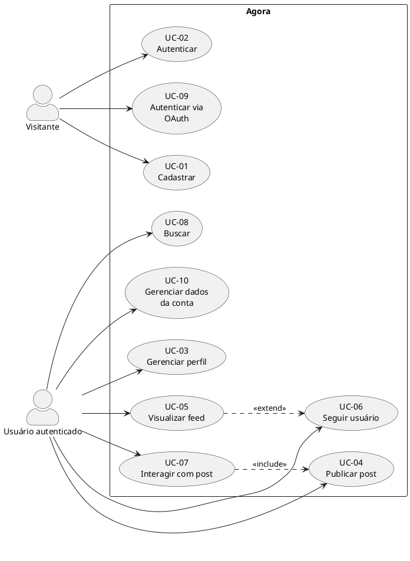

# Casos de Uso

## Diagrama geral

> [!note] Convenção
> Diagrama de casos de uso UML nativo via PlantUML. Cada UC detalhado abaixo segue formato estruturado.

---

## UC-01 — Cadastrar conta

| Campo | Descrição |
|---|---|
| **Ator** | Visitante |
| **RF de origem** | [[01 Requisitos/Requisitos Funcionais#RF-001\|RF-001]] |
| **Pré-condição** | App instalado; e-mail válido em mãos |
| **Fluxo principal** | 1. Usuário abre app → tela de cadastro · 2. Informa e-mail, senha, @apelido · 3. Sistema valida unicidade ([[01 Requisitos/Regras de Negócio\|RN-03]]) · 4. Conta criada e sessão iniciada |
| **Fluxos alternativos** | 2a. E-mail/apelido já existe → erro amigável e nova tentativa |
| **Exceções** | Sem conexão → mensagem e retenção dos campos |
| **Pós-condição** | [[02 Modelagem/Modelo de Domínio#Usuario\|Usuario]] persistido; logado |

## UC-02 — Autenticar

| Campo | Descrição |
|---|---|
| **Ator** | Visitante |
| **RF de origem** | [[01 Requisitos/Requisitos Funcionais#RF-002\|RF-002]] |
| **Pré-condição** | Conta existente; app instalado |
| **Fluxo principal** | 1. Usuário abre app → tela de login · 2. Informa e-mail e senha · 3. Sistema valida hash (RNF-06) · 4. Sessão iniciada, tela de feed |
| **Fluxos alternativos** | 2a. "Esqueci minha senha" → sistema envia link por e-mail · 2b. Credenciais inválidas → erro amigável |
| **Exceções** | Sem conexão → mensagem de erro · Tentativas excedidas → bloqueio temporário (RNF-08) |
| **Pós-condição** | Sessão ativa; token armazenado |

## UC-03 — Gerenciar perfil

| Campo | Descrição |
|---|---|
| **Ator** | Usuário autenticado |
| **RF de origem** | [[01 Requisitos/Requisitos Funcionais#RF-003\|RF-003]] |
| **Pré-condição** | Usuário logado |
| **Fluxo principal** | 1. Usuário abre tela de perfil · 2. Edita nome de exibição, @apelido, bio e/ou avatar · 3. Sistema valida unicidade de @apelido ([[01 Requisitos/Regras de Negócio\|RN-03]]) · 4. Alterações salvas e refletidas imediatamente |
| **Fluxos alternativos** | 2a. @apelido já existe → erro amigável e nova tentativa |
| **Exceções** | Sem conexão → mensagem de erro; dados preservados localmente |
| **Pós-condição** | [[02 Modelagem/Modelo de Domínio#Perfil\|Perfil]] atualizado |

## UC-04 — Publicar post

| Campo | Descrição |
|---|---|
| **Ator** | Usuário autenticado |
| **RF de origem** | [[01 Requisitos/Requisitos Funcionais#RF-004\|RF-004]], [[01 Requisitos/Requisitos Funcionais#RF-006\|RF-006]], [[01 Requisitos/Requisitos Funcionais#RF-016\|RF-016]], [[01 Requisitos/Requisitos Funcionais#RF-022\|RF-022]] |
| **Pré-condição** | Usuário logado |
| **Fluxo principal** | 1. Usuário abre compositor · 2. Digita texto com markdown (RF-004) e syntax highlighting (RF-022) · 3. Seleciona 1–5 tags (RF-016, RN-08/RN-09) · 4. Clica "Publicar" · 5. Sistema valida ≤ 5.000 chars (RN-06) · 6. Post criado com status `Publicado` · 7. Post aparece no feed dos seguidores |
| **Fluxos alternativos** | 3a. Salvar como `Rascunho` → autosave local (RNF-15) · 4a. Editar post existente → atualiza `Editado` (RN-01) |
| **Exceções** | Sem conexão → rascunho preservado localmente · Texto > 5.000 chars → erro de validação |
| **Pós-condição** | [[02 Modelagem/Modelo de Domínio#Post\|Post]] persistido; visível no feed |

## UC-05 — Visualizar feed

| Campo | Descrição |
|---|---|
| **Ator** | Usuário autenticado |
| **RF de origem** | [[01 Requisitos/Requisitos Funcionais#RF-005\|RF-005]], [[01 Requisitos/Requisitos Funcionais#RF-018\|RF-018]] |
| **Pré-condição** | Usuário logado |
| **Fluxo principal** | 1. Usuário abre aba Feed · 2. Sistema exibe posts cronológicos (RN-07) de quem segue + próprios · 3. Paginação ao rolar |
| **Fluxos alternativos** | 2a. Aba "Popular" → feed por tags mais populares (RF-018, MVP) · 2b. Aba "Interesses" → feed por tags seguidas (RF-018, Fase 2 — requer RF-019) |
| **Exceções** | Não segue ninguém → tela com sugestão de usuários · Sem conexão → cache local |
| **Pós-condição** | Nenhuma (operação somente leitura) |

## UC-06 — Seguir usuário

| Campo | Descrição |
|---|---|
| **Ator** | Usuário autenticado |
| **RF de origem** | [[01 Requisitos/Requisitos Funcionais#RF-007\|RF-007]] |
| **Pré-condição** | Usuário logado; perfil de outro usuário visível |
| **Fluxo principal** | 1. Usuário clica "Seguir" no perfil ou busca · 2. Sistema registra relação [[02 Modelagem/Modelo de Domínio#Seguida\|Seguida]] · 3. Posts do seguido passam a aparecer no feed |
| **Fluxos alternativos** | 2a. Já segue → toggle "Deixar de seguir" · 2b. Auto-seguimento → bloqueado (RN-05) |
| **Exceções** | Sem conexão → erro amigável |
| **Pós-condição** | Relação Seguida persistida; feed atualizado |

## UC-07 — Interagir com post (curtir/comentar/excluir)

| Campo | Descrição |
|---|---|
| **Ator** | Usuário autenticado |
| **RF de origem** | [[01 Requisitos/Requisitos Funcionais#RF-008\|RF-008]], [[01 Requisitos/Requisitos Funcionais#RF-009\|RF-009]] |
| **Pré-condição** | Usuário logado; post `Publicado` ou `Editado` visível |
| **Fluxo principal** | 1. **Curtir:** Usuário clica curtir → toggle aplica RN-02 · 2. **Comentar:** Usuário digita texto → comenta cria [[02 Modelagem/Modelo de Domínio#Comentario\|Comentario]] · 3. Interações geram notificação (RF-011 — **Fase 2**, fora do MVP) |
| **Fluxos alternativos** | 1a. Curtir novamente → desfaz (toggle) · 2a. Excluir comentário → apenas autor (RN-01) · 3a. Excluir post → apenas autor (RN-01) |
| **Exceções** | Sem conexão → erro amigável |
| **Pós-condição** | [[02 Modelagem/Modelo de Domínio#Curtida\|Curtida]] ou [[02 Modelagem/Modelo de Domínio#Comentario\|Comentario]] persistido |

## UC-08 — Buscar

| Campo | Descrição |
|---|---|
| **Ator** | Usuário autenticado |
| **RF de origem** | [[01 Requisitos/Requisitos Funcionais#RF-010\|RF-010]], [[01 Requisitos/Requisitos Funcionais#RF-017\|RF-017]] |
| **Pré-condição** | Usuário logado |
| **Fluxo principal** | 1. Usuário digita termo de busca · 2. Sistema retorna resultados separados: usuários (@apelido/nome) · 3. Posts por palavra-chave · 4. Tags por nome/categoria (RF-017) · 5. Usuário navega ao resultado |
| **Fluxos alternativos** | 4a. Busca por tag específica → filtrar posts com aquela tag |
| **Exceções** | Sem resultados → mensagem "Nenhum resultado encontrado" · Sem conexão → erro amigável |
| **Pós-condição** | Nenhuma (operação somente leitura) |

## UC-09 — Autenticar via OAuth

| Campo | Descrição |
|---|---|
| **Ator** | Usuário (não autenticado) |
| **RF de origem** | [[01 Requisitos/Requisitos Funcionais#RF-024\|RF-024]] |
| **Pré-condição** | Usuário não logado; app possui credenciais OAuth configuradas |
| **Fluxo principal** | 1. Usuário clica "Entrar com GitHub" · 2. App abre navegador noAuthorize do GitHub · 3. Usuário autoriza app · 4. GitHub redireciona para callback com code · 5. App envia code para servidor · 6. Servidor troca code por access token no GitHub API · 7. Servidor busca dados do usuário (nome, e-mail, avatar) · 8. Se e-mail já existe → vincula provider · 9. Se não existe → cria USUARIO(provider="github") + PERFIL · 10. Retorna JWT · 11. Sessão iniciada, tela de feed |
| **Fluxos alternativos** | 8a. E-mail já existe com senha local → pergunta: vincular ou usar conta existente? |
| **Exceções** | Usuário recusa autorização → volta para tela de login · Erro na API do GitHub → mensagem "Tente novamente" · Rede indisponível → erro amigável |
| **Pós-condição** | Sessão ativa; conta com provider="github" ou provider local vinculada |

## UC-10 — Gerenciar dados da conta (exclusão/exportação/consentimento — LGPD)

| Campo | Descrição |
|---|---|
| **Ator** | Usuário autenticado |
| **RF de origem** | [[01 Requisitos/Requisitos Funcionais#RF-032\|RF-032]], [[01 Requisitos/Requisitos Funcionais#RF-033\|RF-033]], [[01 Requisitos/Requisitos Funcionais#RF-034\|RF-034]] |
| **Pré-condição** | Usuário logado |
| **Fluxo principal** | 1. Usuário abre "Conta e dados" · 2. **Exportar:** solicita download dos dados pessoais em formato legível (RF-033, RNF-09) · 3. **Excluir:** confirma exclusão da conta (RF-032) · 4. Escolhe entre **remover** ou **manter anônimos** os posts (RN-04) · 5. Sistema agenda anonimização/remoção em até 30 dias |
| **Fluxos alternativos** | 3a. Usuário desiste antes da confirmação → nada muda · 6a. **Consentimento:** usuário visualiza aceite atual (data/versão) e pode revogar (RF-034) |
| **Exceções** | Sem conexão → erro amigável e estado preservado |
| **Pós-condição** | Dados exportados entregues; conta (ou dados pessoais) anonimizada no prazo (RNF-09); consentimento registrado/revogado (RF-034) |

## Verificações de consistência

### UC → RF (rastreabilidade)

| UC | RFs de origem | OK? |
|---|---|:-:|
| UC-01 | RF-001 | ✅ |
| UC-02 | RF-002 | ✅ |
| UC-03 | RF-003 | ✅ |
| UC-04 | RF-004, RF-006, RF-016, RF-022 | ✅ |
| UC-05 | RF-005, RF-018 | ✅ |
| UC-06 | RF-007 | ✅ |
| UC-07 | RF-008, RF-009 | ✅ |
| UC-08 | RF-010, RF-017 | ✅ |
| UC-09 | RF-024, RF-025 | ✅ |
| UC-10 | RF-032, RF-033, RF-034 | ✅ |

### Cobertura

| Métrica | Valor |
|---|:-:|
| UCs com ator identificado | 10/10 ✅ |
| UCs em formato tabela | 10/10 ✅ |
| UCs com pré/pós-condição | 10/10 ✅ |
| UCs com fluxo numerado | 10/10 ✅ |
| **Total UCs** | **10** |

---
Links: [[01 Requisitos/Requisitos Funcionais|RF]] · [[02 Modelagem/Fluxos Principais|Sequências]]
