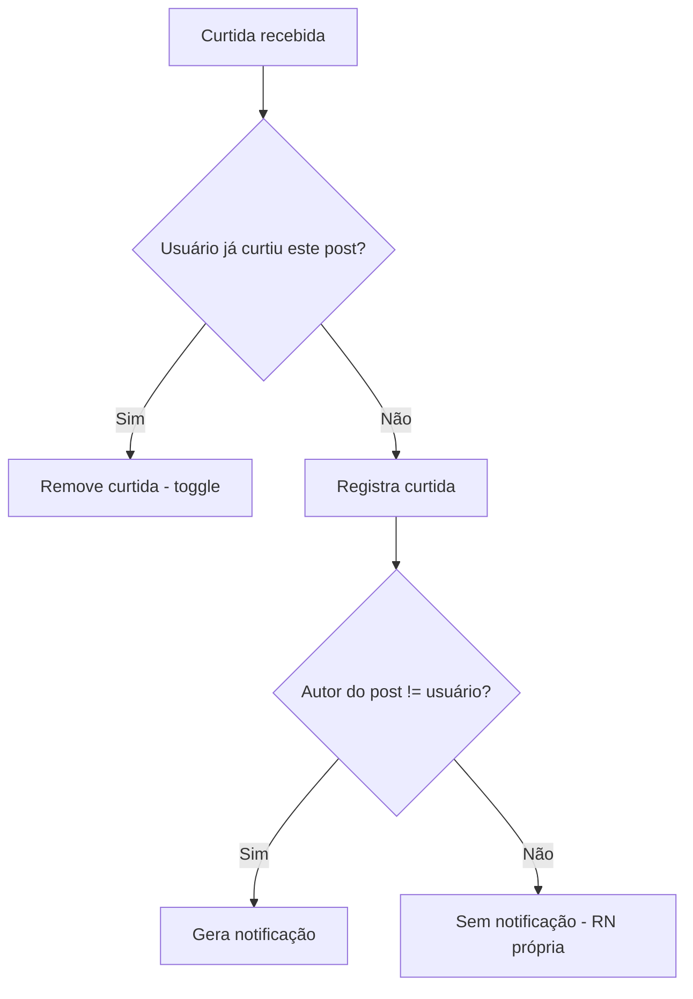

# Regras de Negócio (RN)

| ID    | Regra                                                                                                                                   | Relacionada a  |
| ----- | --------------------------------------------------------------------------------------------------------------------------------------- | -------------- |
| RN-01 | Somente o autor pode editar ou excluir o próprio post/comentário                                                                        | RF-006, RF-009 |
| RN-02 | Um usuário registra no máximo **1 curtida** por post; curtir novamente desfaz (toggle)                                                  | RF-008         |
| RN-03 | Endereço de e-mail e @apelido são únicos no sistema                                                                                     | RF-001, RF-003 |
| RN-04 | Exclusão de conta anonimiza dados pessoais em até 30 dias; posts podem ser removidos ou mantidos como "anônimos" por escolha do usuário | RNF-09, RF-032 |
| RN-05 | Um usuário não pode seguir a si mesmo                                                                                                   | RF-007         |
| RN-06 | Posts têm limite de 5.000 caracteres (configurável) — flexibilizado para suportar blocos de código | RF-004, RF-022 |
| RN-07 | Feed ordena por `data de publicação` descendente; sem promoção algorítmica                                                              | RF-005         |
| RN-08 | Tags são de uso livre; nomes únicos; slug auto-gerado | RF-016, RF-023 |
| RN-09 | Máximo de 5 tags por post                                                                                                               | RF-016         |
| RN-10 | Conta criada via OAuth não possui senha local; login é exclusivo pelo provedor                                                           | RF-024, RF-025 |
| RN-11 | Retenção e limitação de armazenamento: dados pessoais anonimizados em ≤ 30 dias após exclusão da conta; backups do banco de produção retidos ≤ 30 dias; dados do servidor residem em datacenter no Brasil | RNF-09, RNF-26, RF-032 |
| RN-12 | Incidente de segurança com dados pessoais → notificação à ANPD e aos titulares afetados (LGPD art. 48) em prazo razoável (alvo ≤ 72 h da ciência) + registro interno do incidente | RNF-26 |

## Verificações de consistência

### RN → RF

| RN | RFs impactados | OK? |
|---|---|:-:|
| RN-01 | RF-006, RF-009 | ✅ |
| RN-02 | RF-008 | ✅ |
| RN-03 | RF-001, RF-003 | ✅ |
| RN-04 | RF-032, RNF-09 | ✅ |
| RN-05 | RF-007 | ✅ |
| RN-06 | RF-004, RF-022 | ✅ |
| RN-07 | RF-005 | ✅ |
| RN-08 | RF-016, RF-023 | ✅ |
| RN-09 | RF-016 | ✅ |
| RN-10 | RF-024, RF-025 | ✅ |
| RN-11 | RF-032, RNF-09, RNF-26 | ✅ |
| RN-12 | RNF-26 | ✅ |

### Contadores

| Métrica | Valor |
|---|:-:|
| **Total RNs** | **12** |

---
Links: [[01 Requisitos/Requisitos Funcionais|RF]] · [[02 Modelagem/Máquinas de Estado|Máquinas de Estado]]
