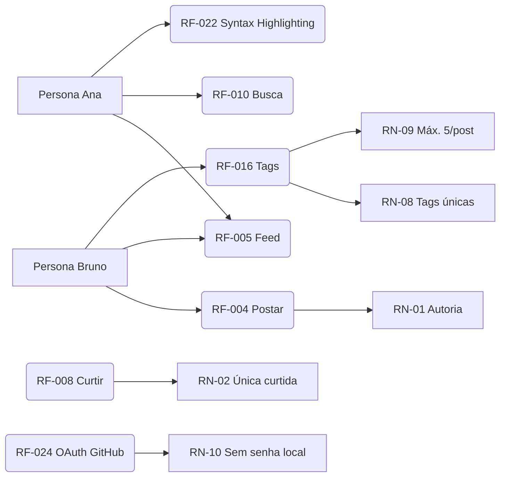

# Requisitos Funcionais (RF)

> [!tip] Legenda de prioridade
> **MoSCoW:** Must = MVP · Should = Fase 2 · Could = Fase 3 · Won't = fora por ora

## Módulo: Conta e Perfil

| ID | Requisito | Prioridade | Caso de uso |
|---|---|:-:|---|
| RF-001 | O sistema deve permitir cadastro com e-mail + senha, validando e-mail único | Must | [[01 Requisitos/Casos de Uso#UC-01 — Cadastrar conta\|UC-01]] |
| RF-002 | O sistema deve permitir autenticação (login/logout) e recuperação de senha por e-mail | Must | [[01 Requisitos/Casos de Uso#UC-02 — Autenticar\|UC-02]] |
| RF-003 | O sistema deve manter perfil editável com: nome de exibição, @apelido único, avatar, bio | Must | [[01 Requisitos/Casos de Uso#UC-03 — Gerenciar perfil\|UC-03]] |

> [!note] Avatar no MVP
> No MVP o avatar é informado por **URL externa** (`avatar_url`). Upload de arquivos de imagem entra na Fase 2 junto com RF-012 (mídia em posts).

## Módulo: Privacidade e LGPD

| ID | Requisito | Prioridade | Caso de uso |
|---|---|---|:-:|---|
| RF-032 | O sistema deve permitir ao usuário excluir a própria conta, com anonimização dos dados pessoais em até 30 dias e escolha entre remover ou manter anônimos os seus posts ([[01 Requisitos/Regras de Negócio\|RN-04]]) | Must | [[01 Requisitos/Casos de Uso#UC-10 — Gerenciar dados da conta\|UC-10]] |
| RF-033 | O sistema deve permitir ao usuário exportar os próprios dados pessoais em formato legível (conformidade [[01 Requisitos/Requisitos Não Funcionais#RNF-09\|RNF-09]]/LGPD) | Must | [[01 Requisitos/Casos de Uso#UC-10 — Gerenciar dados da conta\|UC-10]] |

## Módulo: Publicações e Feed

| ID | Requisito | Prioridade | Caso de uso |
|---|---|:-:|---|
| RF-004 | O usuário autenticado pode publicar posts com markdown (negrito, listas, código inline, blocos de código com syntax highlighting — ver RF-022) | Must | [[01 Requisitos/Casos de Uso#UC-04 — Publicar post\|UC-04]] |
| RF-005 | O sistema deve exibir feed cronológico com posts dos usuários seguidos + próprios, paginado | Must | [[01 Requisitos/Casos de Uso#UC-05 — Visualizar feed\|UC-05]] |
| RF-006 | O autor pode editar ou excluir seus próprios posts ([[01 Requisitos/Regras de Negócio\|RN-01]]) | Must | [[01 Requisitos/Casos de Uso#UC-04 — Publicar post\|UC-04]] |
| RF-016 | O usuário pode adicionar 1–5 tags de conteúdo ao post (ex: `csharp`, `dnd`, `fantasia`) | Must | [[01 Requisitos/Casos de Uso#UC-04 — Publicar post\|UC-04]] |
| RF-017 | O sistema deve permitir busca por tag, filtrando feed e resultados | Must | [[01 Requisitos/Casos de Uso#UC-08 — Buscar\|UC-08]] |
| RF-018 | O sistema deve exibir seção alternativa no feed: no MVP, ordenada por tags mais populares; na Fase 2, por tags que o usuário segue (requer RF-019) | Must | [[01 Requisitos/Casos de Uso#UC-05 — Visualizar feed\|UC-05]] |
| RF-022 | O sistema deve renderizar blocos de código com syntax highlighting, detectando a linguagem a partir da tag do fence markdown (ex: ` ```csharp `) | Must | [[01 Requisitos/Casos de Uso#UC-04 — Publicar post\|UC-04]] |
| RF-023 | O sistema deve exigir campo `categoria` obrigatório nas tags (`linguagem`, `tema`, `genero`, `sistema`) para alimentar filtros e sugestões | Must | [[01 Requisitos/Casos de Uso#UC-04 — Publicar post\|UC-04]] |

> [!note] Bibliotecas (Fase 1)
> Editor/compositor: **AvaloniaEdit** (confirmado — syntax highlighting). Renderização do markdown no feed: **Markdig** como parser padrão (é a base de praticamente todas as opções no ecossistema Avalonia); candidate renderer: `LiveMarkdown.Avalonia` (open-source, Apache 2.0, destaque via TextMateSharp) ou `Avalonia.Controls.Markdown` (oficial, mas nível Pro/Enterprise — pago). ⚠️ Validar no spike: desempenho (RNF-17 ≤ 100 ms) e fidelidade de renderização.

## Módulo: Autenticação Avançada

| ID | Requisito | Prioridade | Caso de uso |
|---|---|:-:|---|
| RF-024 | O sistema deve permitir cadastro/login via OAuth com GitHub | Should | [[01 Requisitos/Casos de Uso#UC-09 — Autenticar via OAuth\|UC-09]] |
| RF-025 | O sistema deve permitir cadastro/login via OAuth com Google | Could | [[01 Requisitos/Casos de Uso#UC-09 — Autenticar via OAuth\|UC-09]] |
| RF-026 | O sistema deve permitir vincular/desvincular conta de provedor externo (1 provedor por conta) | Could | [[01 Requisitos/Casos de Uso#UC-09 — Autenticar via OAuth\|UC-09]] |

## Módulo: Interações Sociais

| ID | Requisito | Prioridade | Caso de uso |
|---|---|:-:|---|
| RF-007 | O usuário pode seguir e deixar de seguir qualquer outro usuário | Must | [[01 Requisitos/Casos de Uso#UC-06 — Seguir usuário\|UC-06]] |
| RF-008 | O usuário pode curtir posts (1 curtida por usuário/post) | Must | [[01 Requisitos/Casos de Uso#UC-07 — Interagir com post (curtir/comentar/excluir)\|UC-07]] |
| RF-009 | O usuário pode comentar posts; autor do post ou do comentário pode excluí-lo | Must | [[01 Requisitos/Casos de Uso#UC-07 — Interagir com post (curtir/comentar/excluir)\|UC-07]] |

## Módulo: Descoberta e Notificações

| ID | Requisito | Prioridade | Caso de uso |
|---|---|:-:|---|
| RF-010 | O sistema deve permitir busca por usuários (@apelido/nome) e posts (palavra-chave) | Must | [[01 Requisitos/Casos de Uso#UC-08 — Buscar\|UC-08]] |
| RF-011 | O sistema deve exibir notificações in-app: nova curtida, novo comentário, novo seguidor | Should | [[01 Requisitos/Casos de Uso#UC-07 — Interagir com post (curtir/comentar/excluir)\|UC-07]] |

## Módulo: UI / Experiência

| ID | Requisito | Prioridade | Caso de uso |
|---|---|:-:|---|
| RF-031 | O sistema deve exibir tela de splash/loading com logo (letter metálica + partes azuis) ao iniciar: flash no metal + energia cristalina nas partes azuis | Must | [[01 Requisitos/Casos de Uso#UC-01 — Cadastrar conta\|UC-01]] |

## Backlog faseado

| ID | Requisito | Prioridade |
|---|---|:-:|
| RF-012 | O sistema deve permitir upload de mídia (imagem) em posts | Should |
| RF-013 | O sistema deve permitir mensagens diretas 1:1 entre usuários | Should |
| RF-019 | O sistema deve permitir que o usuário siga tags, não só usuários | Should |
| RF-020 | O sistema deve permitir flair de perfil (badge visual: "C# Dev", "Mestre D&D", "Leitor") | Should |
| RF-021 | O sistema deve permitir perfil expandido (stack tech, jogos favoritos, autores favoritos) | Should |
| RF-014 | O sistema deve permitir contas privadas (aprovação de seguidores) | Could |
| RF-015 | O sistema deve permitir moderação: denúncia de conteúdo/usuário | Could |
| RF-024 | O sistema deve permitir cadastro/login via OAuth com GitHub | Should |
| RF-025 | O sistema deve permitir cadastro/login via OAuth com Google | Could |
| RF-026 | O sistema deve permitir vincular/desvincular conta de provedor externo (1 provedor por conta) | Could |
| RF-027 | O sistema deve permitir biblioteca de livros no perfil (lista lidos, want-to-read, nota pessoal, resenha) | Could |
| RF-028 | O sistema deve permitir integração com GitHub (repositórios, projetos recentes, tech stack) | Could |
| RF-029 | O sistema deve permitir lista de jogos jogados (horas jogadas, review, plataforma) | Could |
| RF-030 | O sistema deve permitir mesas e campanhas de RPG (mesa, sessão, ficha, sistema, one-shots) | Could |

## Rastreabilidade



## Verificações de consistência

### RF → UC (todas devem ter pelo menos 1 UC)

| RF | UC vinculado | OK? |
|---|---|:-:|
| RF-001 | UC-01 | ✅ |
| RF-002 | UC-02 | ✅ |
| RF-003 | UC-03 | ✅ |
| RF-004 | UC-04 | ✅ |
| RF-005 | UC-05 | ✅ |
| RF-006 | UC-04 | ✅ |
| RF-007 | UC-06 | ✅ |
| RF-008 | UC-07 | ✅ |
| RF-009 | UC-07 | ✅ |
| RF-010 | UC-08 | ✅ |
| RF-011 | UC-07 | ✅ |
| RF-016 | UC-04 | ✅ |
| RF-017 | UC-08 | ✅ |
| RF-018 | UC-05 | ✅ |
| RF-022 | UC-04 | ✅ |
| RF-023 | UC-04 | ✅ |
| RF-024 | UC-09 | ✅ |
| RF-025 | UC-09 | ✅ |
| RF-026 | UC-09 | ✅ |
| RF-031 | UC-01 | ✅ |
| RF-032 | UC-10 | ✅ |
| RF-033 | UC-10 | ✅ |

### RN → RF (impactados)

| RN | RFs impactados |
|---|---|
| RN-01 | RF-006, RF-009 |
| RN-02 | RF-008 |
| RN-03 | RF-001, RF-003 |
| RN-06 | RF-004, RF-022 |
| RN-07 | RF-005 |
| RN-08 | RF-016, RF-023 |
| RN-09 | RF-016 |
| RN-10 | RF-024, RF-025 |

### Contadores

| Métrica | Valor |
|---|:-:|
| RFs Must (MVP) | 18 |
| RFs Should (Fase 2) | 7 |
| RFs Could (Fase 3) | 8 |
| **Total RFs** | **33** |

---

Links: [[Resumo dos Requisitos]] · [[01 Requisitos/Regras de Negócio|RN]] · [[01 Requisitos/Casos de Uso|UC]] · [[04 Gestão/Backlog do Produto|Backlog]]
