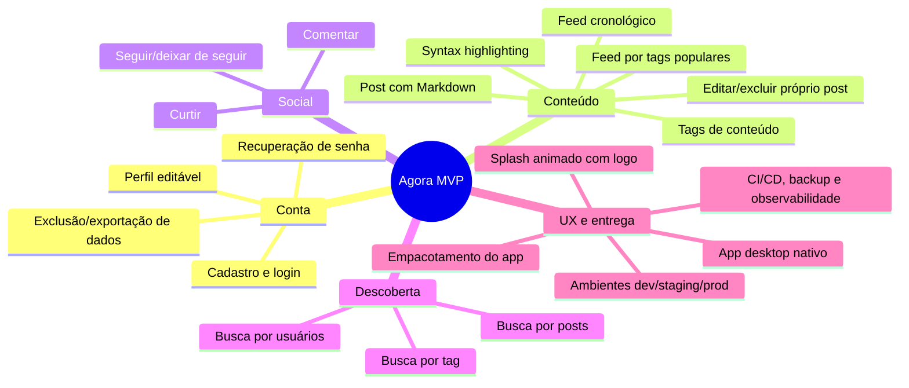
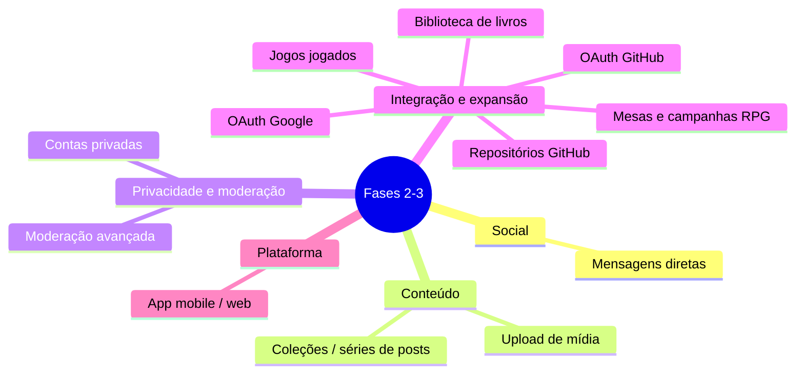

# Visão do Produto

## 1. Problema
Redes sociais populares são otimizadas para engajamento algorítmico, escondendo conteúdo e exigindo apps móveis. Usuários de hobbies nerd (programadores, RPG de mesa, leitores, gamers) não têm uma plataforma desktop **leve, rápida e cronológica** para compartilhar e descobrir conteúdo por interesse.

> [!info] Público-alvo de nicho (escopo de pessoa)
> | Anel | Nichos |
> |---|---|
> | **Primário** (foco do produto) | Jogadores, jogadores de RPG de mesa, leitores, programadores |
> | **Secundário** (possível) | Musicistas e apreciadores de música, cinéfilos e hobbies similares |
> | **Distante** (ainda plausível) | Outros hobbies (ex.: ciclismo e afins) |
>
> Detalhes em [[01 Requisitos/Stakeholders e Personas|Stakeholders e Personas]].

## 2. Solução proposta
**Agora** (do grego: praça pública) — aplicativo **desktop nativo em C#** de rede social focado em hobbies nerd, com feed cronológico, tags de conteúdo, markdown em posts e suporte a syntax highlighting. Nome do produto: **Agora**.

## 3. Objetivos (OKRs propostos)

### O1 — Entregar um MVP utilizável
- KR1: 18 requisitos funcionais do MVP concluídos até o fim da Fase 1 ([[04 Gestão/Roadmap|Roadmap]])
- KR2: Feed carrega em ≤ 2 s (P95) com dados reais
- KR3: Zero bugs críticos abertos no lançamento interno

### O2 — Validar valor com usuários reais
- KR1: 20 usuários beta ativos na semana 1 pós-lançamento ⚠️
- KR2: ≥ 50% dos betas publicam ao menos 1 post/semana ⚠️

## 4. Escopo

> [!note] Convenção
> O primeiro mapa representa o escopo do MVP da Fase 1; o segundo reúne itens de expansão planejados para Fases 2-3. Isso separa claramente o que faz parte do produto atual do que é roadmap futuro.

**Escopo atual (Fase 1):** feed cronológico, posts com Markdown e tags, interações sociais básicas, busca, conta, splash e infraestrutura mínima necessária. **Fases 2-3:** mensagens diretas, upload de mídia, integrações OAuth, contas privadas, moderação, extensões de nicho e plataformas adicionais.

## 5. Diferenciais
1. Feed **cronológico** sem algoritmo (ver persona Bruno)
2. Desempenho desktop nativo (persona Ana)
3. **Tags de conteúdo** para descoberta por hobby/tema
4. **Markdown em posts** com syntax highlighting (persona Dev)
5. Simplicidade deliberada de recursos

## 6. Premissas e restrições
- [!] **Premissa confirmada:** componente servidor desde o início — modelo cliente-servidor decidido em [[03 Decisões/ADR-002 Implantação|ADR-002]]
- Confirmado: banco do servidor em **PostgreSQL (Npgsql)** — [[03 Decisões/ADR-007 Banco do Servidor (Npgsql)|ADR-007]]; avatar no MVP via URL externa (upload de arquivos na Fase 2)
- Confirmado: sessão desktop com refresh token **via DPAPI** — [[03 Decisões/ADR-008 Segurança de Sessão (DPAPI)|ADR-008]]
- Restrição: equipe pequena (1–3 devs) ⚠️; prazo alvo Fase 1: ~3 meses ⚠️

## 7. Riscos iniciais

| Risco                          | Impacto | Prob. | Mitigação                                                        |
| ------------------------------ | ------- | ----- | ---------------------------------------------------------------- |
| Escopo crescer (feature creep) | Alto    | Alta  | Backlog MoSCoW rigoroso                                          |
| Decisão errada de stack UI     | Médio   | Média | [[03 Decisões/ADR-001 Stack Tecnológica\|ADR-001]] com protótipo |
| Backend subdimensionado        | Alto    | Média | ADR de implantação antes da Fase 1                               |

---
Links: [[Home]] · [[01 Requisitos/Stakeholders e Personas|Personas]] · [[04 Gestão/Backlog do Produto|Backlog]]
