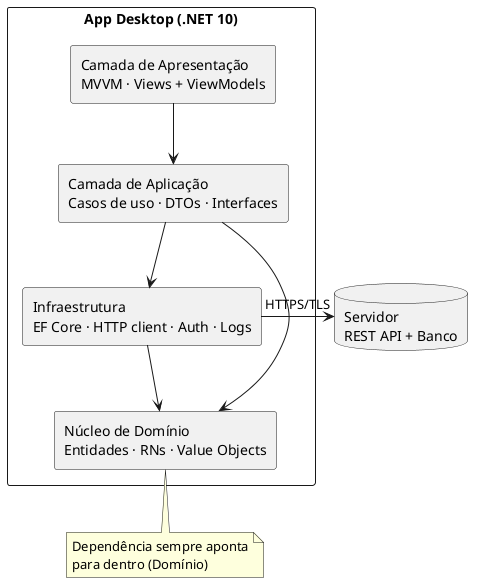
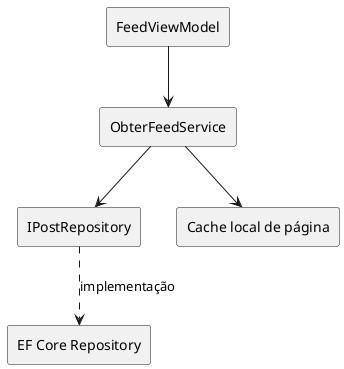

# Arquitetura do Sistema

> [!warning] Decisão aberta (impacto alto)
> Modelo de implantação decidido: **B — Cliente-servidor** ([[03 Decisões/ADR-002 Implantação|ADR-002]]).

## Visão em camadas (aplicação desktop)

## Regras das camadas

| Camada | Responsabilidade | Pode depender de |
|---|---|---|
| Apresentação | Telas, bindings, UX | Aplicação |
| Aplicação | Orquestra casos de uso (UC-01..09) | Domínio, abstrações de Infra |
| Domínio | Entidades + regras ([[01 Requisitos/Regras de Negócio\|RN]]) | **Nada** (POCO puro) |
| Infra | Persistência, rede, crypto | Domínio |

> [!important] Dependência sempre aponta para dentro (Domínio)
> Testabilidade (RNF-13) e troca de SGBD/UI dependem disso.

## Componentes-chave

## Requisitos que moldaram a arquitetura
- RNF-10 → camadas desacopladas da UI específica
- RNF-12/RNF-13 → separação domínio/aplicação + testes
- RNF-15 → cache/rascunho local mesmo offline
- RNF-07/RNF-06 → TLS + hash de senha na Infra

## Alternativas consideradas
1. **Monólito local (sem servidor)** — inviável para rede social multiusuário de hobby
2. **Cliente fino + tudo no servidor** — perde RNF-15; adotar parcialmente via cache
3. **Camadas como acima** ✅ escolhida (detalhes em [[03 Decisões/ADR-002 Implantação|ADR-002]])

---
Links: [[03 Decisões/ADR Template|ADRs]] · [[02 Modelagem/Fluxos Principais|Fluxos]] · [[01 Requisitos/Requisitos Não Funcionais|RNF]]
