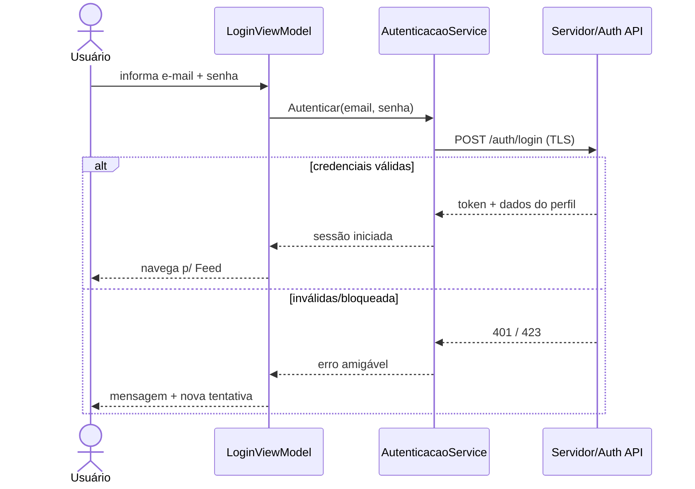
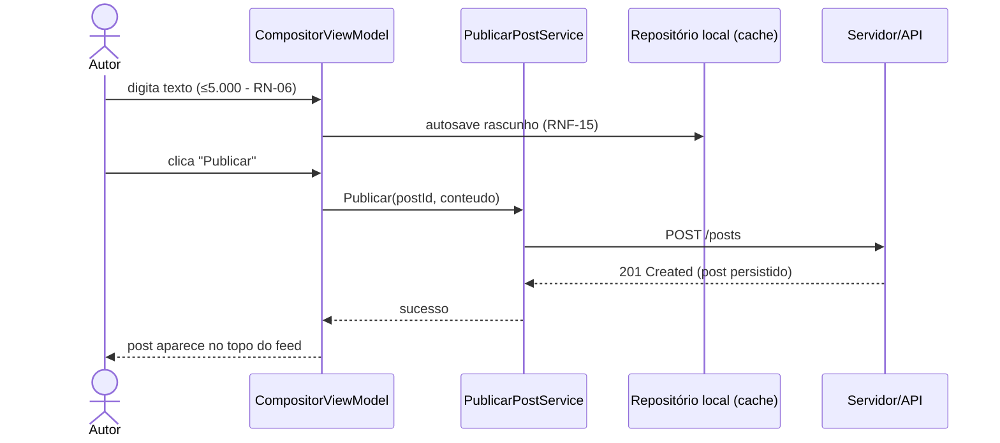
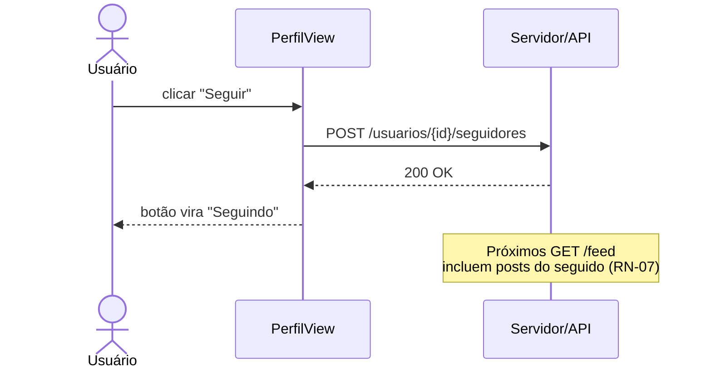
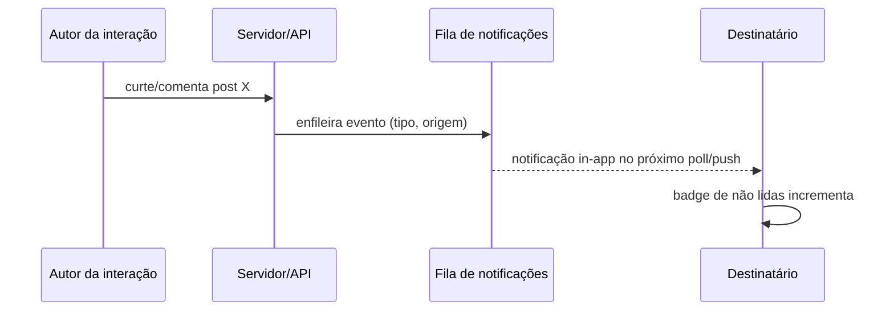
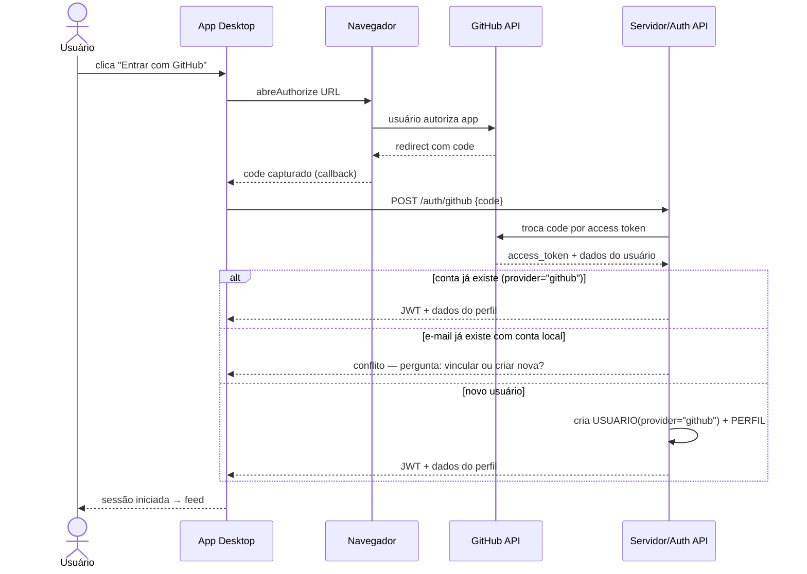

# Fluxos Principais (Diagramas de Sequência)

> [!note] Convenção
> Todos os diagramas usam Mermaid `sequenceDiagram`. Participantes: VM = ViewModel, APP = Service/Application, DB = Repositório local, SRV = Servidor/API.

## 1. Autenticar (UC-02)



## 2. Publicar post (UC-04)



> [!note] Offline
> Se o passo com `SRV` falhar, o post permanece `Rascunho` local e reenvia quando a conexão voltar.

## 3. Seguir usuário e efeito no feed (UC-06)



## 4. Interação gera notificação (RF-011)



## 5. Publicar post com tags (UC-04 + RF-016/017)

```mermaid
sequenceDiagram
    actor U as Autor
    participant VM as CompositorViewModel
    participant APP as PublicarPostService
    participant DB as Repositório local (cache)
    participant SRV as Servidor/API

    U->>VM: digita texto (≤5.000 - RN-06)
    U->>VM: seleciona 1–5 tags (RF-016)
    VM->>DB: autosave rascunho (RNF-15)
    U->>VM: clica "Publicar"
    VM->>APP: Publicar(postId, conteudo, tags)
    APP->>SRV: POST /posts + POST /posts/{id}/tags
    SRV-->>APP: 201 Created
    APP-->>VM: sucesso
    VM-->>U: post aparece no feed; tags indexadas para busca
```

## 6. Autenticar via OAuth — GitHub (UC-09)



---

Links: [[02 Modelagem/Arquitetura do Sistema|Arquitetura]] · [[01 Requisitos/Casos de Uso|UC]]
