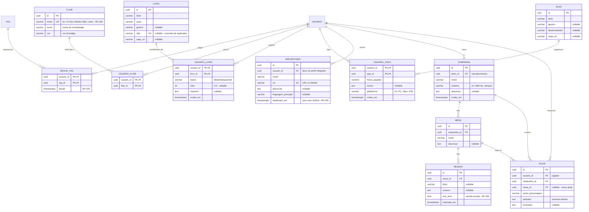

# Modelo de Dados (ER)

> [!info] Relação com o domínio
> Derivado de [[02 Modelagem/Modelo de Domínio]]. Nomes de tabelas em `snake_case`; PK/FK explícitas. SGBD: **SQLite** no client (configs locais, rascunho RNF-15, cache — [[03 Decisões/ADR-003 Persistência|ADR-003]]) / **PostgreSQL via Npgsql** no servidor ([[03 Decisões/ADR-007 Banco do Servidor (Npgsql)|ADR-007]]). Inclui suporte a OAuth (RF-024, RF-025).

## 1. MER — Modelo Entidade-Relacionamento (conceitual)

> Modelo conceitual: entidades, atributos e relacionamentos, sem detalhes físicos de implementação. A derivação das tabelas (índices, constraints, migrações) está na seção **DER** abaixo.

### 1.1 Núcleo — Fase 1 (MVP)

### 1.2 Módulos futuros — Fases 2 e 3

> [!note] Extensão do PERFIL (Fase 2 — RF-021)
> `PERFIL` ganha campos opcionais (opt-in, D-5): `stack_tech` (ex: "C#, .NET, Avalonia"), `jogos_favoritos` e `autores_favoritos` — conteúdo livre, sem tabelas novas. Flair/lista de livros/jogos vêm das relações F3 acima.

> [!note] Convenção
> Diagrama ER via Mermaid `erDiagram`. `||--||` = 1:1, `||--o{` = 1:N, `}o--o{` = N:N. PK/FK explícitas; `UK` = unique key. Constraints detalhados na seção **DER** (2.2).

## 2. DER — Diagrama Entidade-Relacionamento (físico)

> Detalhamento de implementação do **MER** acima: índices, constraints e critérios de migração sobre o SGBD (SQLite client / PostgreSQL server).

### 2.1 Índices essenciais

| Tabela | Índice | Motivo |
|---|---|---|
| USUARIO | `(email)` | Login por e-mail (RF-002) |
| USUARIO | `(apelido)` | Busca por @ (RF-010) |
| USUARIO | `(provider, provider_id)` | Login OAuth — busca por provedor (RF-024) |
| POST | `(autor_id, status, publicado_em DESC)` | Feed e perfil |
| POST | `GIN/conteudo` (tsvector) | RF-010 busca textual — FTS Postgres (ADR-007) · cache local usa LIKE |
| COMENTARIO | `(post_id, criado_em)` | Listar comentários de um post em ordem cronológica |
| CURTIDA | já coberta pela PK composta | RN-02 |
| SEGUIDA | `(seguido_id)` adicional | Listar seguidores |
| NOTIFICACAO | `(usuario_destino, lida, criado_em DESC)` | Badge não lidas |
| TAG | `(categoria)` | Busca por categoria |
| POST_TAG | já coberta pela PK composta | RN-09 |
| SEGUE_TAG | `(tag_id)` | Feed por interesses (RF-018 F2) |
| USUARIO_FLAIR | `(flair_id)` | Listar usuários de um badge |
| USUARIO_LIVRO | `(livro_id)`, `(status)` | Biblioteca e filtros por status |
| USUARIO_JOGO | `(jogo_id)` | Lista de jogos e ordenação |
| REPOSITORIO | `(usuario_id)` | Perfil GitHub (RF-028) |
| SESSAO | `(mesa_id, realizada_em DESC)` | Histórico de sessões |
| FICHA | `(campanha_id)`, `(usuario_id)` | Personagens por campanha/jogador |

### 2.2 Constraints

| Tabela | Constraint | Expressão | Regra |
|---|---|---|---|
| USUARIO | `UK_email` | `email UNIQUE` | RN-03 |
| USUARIO | `UK_apelido` | `apelido UNIQUE` | RN-03 |
| POST | `CHK_status` | `status IN ('rascunho','publicado','editado','arquivado','excluido')` | Valores válidos |
| SEGUIDA | `CHK_autoseguimento` | `seguidor_id <> seguido_id` | RN-05 |
| USUARIO | `CHK_provider` | `provider IN ('local','github','google')` | Valores válidos |
| USUARIO | `CHK_provider_senha` | `(provider = 'local' AND hash_senha IS NOT NULL) OR (provider <> 'local' AND hash_senha IS NULL)` | RN-10: local precisa senha, OAuth não |
| TAG | `UK_nome` | `nome UNIQUE` | RN-08 |
| TAG | `UK_slug` | `slug UNIQUE` | RN-08 |
| FLAIR | `UK_nome` | `nome UNIQUE` | Badge único (RF-020) |
| USUARIO_LIVRO | `CHK_status_leitura` | `status IN ('lido','lendo','queroler')` | Valores válidos (RF-027) |
| USUARIO_LIVRO | `CHK_nota` | `nota IS NULL OR (nota BETWEEN 0 AND 5)` | Escala 0–5 |
| REPOSITORIO | `UK_url` | `url UNIQUE` | Sem repo duplicado (RF-028) |

> [!note] Soft delete em COMENTARIO
> No MVP, exclusão de comentário é hard delete. Se RF-015 (moderação) for implementada, adicionar coluna `status` em COMENTARIO seguindo o mesmo padrão de POST.

> [!note] Entidades das Fases 2/3 — modeladas
> `SEGUE_TAG`, `FLAIR`, `USUARIO_FLAIR` (Fase 2) e `LIVRO`, `USUARIO_LIVRO`, `JOGO`, `USUARIO_JOGO`, `REPOSITORIO`, `CAMPANHA`, `MESA`, `SESSAO`, `FICHA` (Fase 3) foram modeladas em **2026-08-29** (acima, na seção MER 1.2). Origem conceitual em [[VAULT/Plano - Rede Social de Nicho]] e consolidadas pelo [[VAULT/Checklist - Correções do Plano|Checklist (F.2)]].

### 2.3 Migrações
- Ferramenta candidata: **EF Core Migrations** ([[03 Decisões/ADR-003 Persistência|ADR-003]])
- Regra: toda mudança de schema nasce no DER como migração versionada

---
Links: [[02 Modelagem/Arquitetura do Sistema|Arquitetura]] · [[04 Gestão/Glossário|Glossário]]
