# Modelo de Domínio (UML)

> [!info] Relação com o ER
> Este documento modela as **entidades de negócio** e seus relacionamentos. A implementação relacional detalhada vive em [[02 Modelagem/Modelo de Dados (ER)|Modelo de Dados (ER)]].

## Diagrama de classes

```plantuml
@startuml
skinparam classAttributeIconSize 0
hide circle

class Usuario {
  -Id : Guid
  -Email : string <<unique>>
  -Apelido : string <<unique>>
  -NomeExibicao : string
  -HashSenha : byte[] <<nullable>>
  -Provider : string <<local|github|google>>
  -ProviderId : string <<nullable>>
  -Ativo : bool
  -ExclusaoAgendadaEm : DateTime? <<nullable, RN-04>>
  -DestinoPosts : string <<remover|anonimizar, nullable>>
  -CriadoEm : DateTime
  --
  +Publicar(conteudo, tags) : Post
  +Editar(postId, conteudo) : void
  +Excluir(postId) : void
  +Seguir(usuarioId) : void
  +DeixarDeSeguir(usuarioId) : void
  +Curtir(postId) : void
  +Comentar(postId, texto) : Comentario
}

class Perfil {
  -UsuarioId : Guid <<PK, FK>>
  -Bio : string
  -AvatarUrl : string
  -StackTech : string <<nullable, Fase 2 - RF-021>>
  -JogosFavoritos : string <<nullable, Fase 2 - RF-021>>
  -AutoresFavoritos : string <<nullable, Fase 2 - RF-021>>
  --
  +Atualizar(bio, avatarUrl) : void
}

class Post {
  -Id : Guid
  -AutorId : Guid <<FK>>
  -Conteudo : string <<≤5.000 chars>>
  -Status : string <<rascunho|publicado|editado|arquivado|excluido>>
  -PublicadoEm : DateTime
  -EditadoEm : DateTime
  --
  +Publicar() : void
  +Editar(novoConteudo) : void
  +Arquivar() : void
  +Excluir() : void
}

class Comentario {
  -Id : Guid
  -PostId : Guid <<FK>>
  -AutorId : Guid <<FK>>
  -Texto : string
  -CriadoEm : DateTime
  --
  +Excluir() : void
}

class Curtida {
  -UsuarioId : Guid <<PK, FK>>
  -PostId : Guid <<PK, FK>>
  -CriadoEm : DateTime
  --
  +Toggle() : void
}

class Seguida {
  -SeguidorId : Guid <<PK, FK>>
  -SeguidoId : Guid <<PK, FK>>
  -Desde : DateTime
}

class Notificacao {
  -Id : Guid
  -UsuarioDestino : Guid <<FK>>
  -Tipo : string <<curtida|comentario|seguidor>>
  -ReferenciaId : Guid
  -Lida : bool
  -CriadoEm : DateTime
  --
  +MarcarLida() : void
}

class Consentimento {
  -Id : Guid
  -UsuarioId : Guid <<FK>>
  -Politica : string <<privacidade|termos>>
  -Versao : string
  -AceitoEm : DateTime
  -RevogadoEm : DateTime? <<nullable>>
  --
  +Registrar(politica, versao) : void
  +Revogar() : void
}

class Tag {
  -Id : Guid
  -Nome : string <<unique>>
  -Slug : string <<auto-gerado>>
  -Categoria : string <<linguagem|tema|genero|sistema>>
  -UsosCount : int <<denormalizado - RF-018>>
}

class PostTag {
  -PostId : Guid <<PK, FK>>
  -TagId : Guid <<PK, FK>>
}

' == Entidades das Fases 2/3 ==
class SegueTag {
  -UsuarioId : Guid <<PK, FK>>
  -TagId : Guid <<PK, FK>>
  -Desde : DateTime
  --
  +Seguir(tagId) : void
  +DeixarDeSeguir(tagId) : void
}

class Flair {
  -Id : Guid
  -Nome : string <<unique>>
  -Icone : string
  -Cor : string
}

class UsuarioFlair {
  -UsuarioId : Guid <<PK, FK>>
  -FlairId : Guid <<PK, FK>>
}

class Livro {
  -Id : Guid
  -Titulo : string
  -Autor : string
  -Genero : string
  -Isbn : string <<unique, nullable>>
  -CapaUrl : string <<nullable>>
}

class UsuarioLivro {
  -UsuarioId : Guid <<PK, FK>>
  -LivroId : Guid <<PK, FK>>
  -Status : string <<lido|lendo|queroler>>
  -Nota : int <<nullable>>
  -Resenha : string <<nullable>>
  -CriadoEm : DateTime
}

class Jogo {
  -Id : Guid
  -Titulo : string
  -Genero : string
  -Desenvolvedor : string
  -CapaUrl : string <<nullable>>
}

class UsuarioJogo {
  -UsuarioId : Guid <<PK, FK>>
  -JogoId : Guid <<PK, FK>>
  -HorasJogadas : decimal
  -Review : string <<nullable>>
  -Plataforma : string
  -CriadoEm : DateTime
}

class Repositorio {
  -Id : Guid
  -UsuarioId : Guid <<FK>>
  -Nome : string
  -Url : string <<unique>>
  -Descricao : string <<nullable>>
  -LinguagemPrincipal : string <<nullable>>
  -AtualizadoEm : DateTime
}

class Campanha {
  -Id : Guid
  -DonoId : Guid <<FK>>
  -Nome : string
  -Sistema : string
  -Descricao : string <<nullable>>
  -CriadoEm : DateTime
  --
  +CriarMesa(nome) : Mesa
  +AgendarSessao(mesaId, data) : Sessao
}

class Mesa {
  -Id : Guid
  -CampanhaId : Guid <<FK>>
  -Nome : string
  -Descricao : string <<nullable>>
}

class Sessao {
  -Id : Guid
  -MesaId : Guid <<FK>>
  -Titulo : string <<nullable>>
  -Resumo : string <<nullable>>
  -OneShot : bool
  -RealizadaEm : DateTime
}

class Ficha {
  -Id : Guid
  -UsuarioId : Guid <<FK>>
  -CampanhaId : Guid <<FK>>
  -MesaId : Guid <<FK, nullable>>
  -NomePersonagem : string
  -Atributos : string <<estrutura aberta>>
  -Inventario : string <<nullable>>
}

Usuario "1" *-- "1" Perfil : possui
Usuario "1" *-- "0..*" Post : escreve
Usuario "1" *-- "0..*" Comentario : escreve
Usuario "1" *-- "0..*" Curtida : registra
Usuario "1" *-- "0..*" Seguida : segue
Usuario "1" *-- "0..*" Notificacao : recebe
Usuario "1" *-- "0..*" Consentimento : aceita
Post "1" *-- "0..*" Comentario : recebe
Post "1" *-- "0..*" Curtida : recebe
Post "1" *-- "0..*" PostTag : classifica
Tag "1" *-- "0..*" PostTag : classifica
Usuario "1" *-- "0..*" SegueTag : segue
Tag "1" *-- "0..*" SegueTag : seguida por
Usuario "1" *-- "0..*" UsuarioFlair : possui
Flair "1" *-- "0..*" UsuarioFlair : atribuída a
Usuario "1" *-- "0..*" UsuarioLivro : registra
Livro "1" *-- "0..*" UsuarioLivro : na biblioteca de
Usuario "1" *-- "0..*" UsuarioJogo : joga
Jogo "1" *-- "0..*" UsuarioJogo : jogado por
Usuario "1" *-- "0..*" Repositorio : possui
Usuario "1" *-- "0..*" Campanha : narra
Campanha "1" *-- "0..*" Mesa : tem
Mesa "1" *-- "0..*" Sessao : tem
Usuario "1" *-- "0..*" Ficha : interpreta
Campanha "1" *-- "0..*" Ficha : contém
Mesa "1" *-- "0..*" Ficha : joga na

note right of Post
  Estados detalhados em
  [[Máquinas de Estado]]
end note

note bottom of Tag
  RN-08: nomes únicos
  RN-09: máx. 5/post
end note
@enduml
```

## Entidades e regras de negócio

| Entidade                          | Responsabilidade                                                               | RN aplicável                                                                                                         |
| --------------------------------- | ------------------------------------------------------------------------------ | -------------------------------------------------------------------------------------------------------------------- |
| [[#Usuario\|Usuario]]             | Conta, credenciais, estado ativo/inativo, provedor OAuth                       | [[01 Requisitos/Regras de Negócio\|RN-03]] (unicidade), [[01 Requisitos/Regras de Negócio\|RN-10]] (OAuth sem senha) |
| [[#Perfil\|Perfil]]               | Dados de exibição (1:1 com Usuario)                                            | —                                                                                                                    |
| [[#Post\|Post]]                   | Publicação de texto; máquina de estados em [[02 Modelagem/Máquinas de Estado]] | [[01 Requisitos/Regras de Negócio\|RN-01]] (autoria), [[01 Requisitos/Regras de Negócio\|RN-06]] (5.000 chars)       |
| [[#Comentario\|Comentario]]       | Resposta a um Post                                                             | [[01 Requisitos/Regras de Negócio\|RN-01]]                                                                           |
| [[#Curtida\|Curtida]]             | Marcação positiva única por usuário/post                                       | [[01 Requisitos/Regras de Negócio\|RN-02]] (toggle)                                                                  |
| [[#Seguida\|Seguida]]             | Relação direcionada seguidor → seguido                                         | [[01 Requisitos/Regras de Negócio\|RN-05]] (auto-seguimento)                                                         |
| [[#Notificacao\|Notificacao]] | Eventos para o destinatário (Fase 2 — RF-011) | [[01 Requisitos/Requisitos Funcionais\|RF-011]] |
| [[#Consentimento\|Consentimento]] | Registro de aceite/revogação de privacidade×termos (data/versão)               | [[01 Requisitos/Requisitos Funcionais\|RF-034]]                                                                      |
| [[#Tag\|Tag]]                     | Classificador de conteúdo por tema/hobby                                       | [[01 Requisitos/Regras de Negócio\|RN-08]] (nomes únicos), [[01 Requisitos/Regras de Negócio\|RN-09]] (máx. 5/post)  |
| [[#PostTag\|PostTag]]             | Relação N:N post-tag                                                           | —                                                                                                                    |
| [[#SegueTag\|SegueTag]]           | Relação N:N usuário-tag (feed por interesse)                                   | [[01 Requisitos/Requisitos Funcionais\|RF-019]]                                                                      |
| [[#Flair\|Flair]]                 | Badge visual de perfil (ex: "C# Dev", "Mestre D&D")                            | [[01 Requisitos/Requisitos Funcionais\|RF-020]]                                                                      |
| [[#UsuarioFlair\|UsuarioFlair]]   | Relação N:N usuário-flair                                                      | —                                                                                                                    |
| [[#Livro\|Livro]]                 | Catálogo global de livros                                                      | [[01 Requisitos/Requisitos Funcionais\|RF-027]]                                                                      |
| [[#UsuarioLivro\|UsuarioLivro]]   | Estado de leitura por usuário (lido/lendo/queroler + nota/resenha)             | [[01 Requisitos/Requisitos Funcionais\|RF-027]]                                                                      |
| [[#Jogo\|Jogo]]                   | Catálogo global de jogos                                                       | [[01 Requisitos/Requisitos Funcionais\|RF-029]]                                                                      |
| [[#UsuarioJogo\|UsuarioJogo]]     | Horas jogadas, review e plataforma por usuário                                 | [[01 Requisitos/Requisitos Funcionais\|RF-029]]                                                                      |
| [[#Repositorio\|Repositorio]]     | Repositório GitHub vinculado ao perfil                                         | [[01 Requisitos/Requisitos Funcionais\|RF-028]]                                                                      |
| [[#Campanha\|Campanha]]           | Narrativa RPG com sistema; dono é o narrador                                   | [[01 Requisitos/Requisitos Funcionais\|RF-030]]                                                                      |
| [[#Mesa\|Mesa]]                   | Grupo de jogadores de uma campanha                                             | [[01 Requisitos/Requisitos Funcionais\|RF-030]]                                                                      |
| [[#Sessao\|Sessao]]               | Encontro de uma mesa; pode ser one-shot                                        | [[01 Requisitos/Requisitos Funcionais\|RF-030]]                                                                      |
| [[#Ficha\|Ficha]]                 | Personagem de um jogador em uma campanha                                       | [[01 Requisitos/Requisitos Funcionais\|RF-030]]                                                                      |

## Detalhes das entidades

### Usuario
- **Identificador:** `Id` (UUID)
- **Constraints:** `Email` único, `Apelido` único (RN-03)
- **Provider:** `local` | `github` | `google` — contas OAuth têm `HashSenha` nulo (RN-10)
- **Estados:** `Ativo` / `Inativo` (exclusão anonimiza dados em 30 dias — RN-04)
- **Exclusão (RF-032):** `ExclusaoAgendadaEm` agenda a anonimização em ≤ 30 d; `DestinoPosts` (`remover`/`anonimizar`) decide o destino dos posts

### Perfil
- **Relação 1:1** com Usuario (chave `UsuarioId` FK)
- Contém apenas dados de exibição: bio e URL do avatar
- **Fase 2 (RF-021):** campos opcionais (opt-in) `StackTech`, `JogosFavoritos`, `AutoresFavoritos`

### Post
- **Estados:** Rascunho → Publicado → Editado / Arquivado / Excluído (detalhes em [[02 Modelagem/Máquinas de Estado]])
- `Conteudo` limitado a 5.000 caracteres (RN-06) — flexibilizado para blocos de código
- `Status` persistido como string no banco (detalhes em [[02 Modelagem/Modelo de Dados (ER)|ER]])

### Comentario
- Resposta a um Post; FK `PostId` e `AutorId`
- Exclusão apenas pelo autor (RN-01)

### Curtida
- PK composta: (`UsuarioId`, `PostId`)
- Toggle: curtir novamente desfaz (RN-02)

### Seguida
- PK composta: (`SeguidorId`, `SeguidoId`)
- Auto-seguimento proibido (RN-05)
- Direcionada: seguidor ≠ seguido

### Notificacao
- **Fase 2 (RF-011)** — gerada por interações MVP (curtida/comentário/seguidor), consumida na Fase 2 (badge/lista)
- Tipos: `curtida`, `comentario`, `seguidor`
- `Lida` controla badge de não lidas

### Consentimento
- Registro de aceite da Política de Privacidade/Termos: `Politica`, `Versao` e `AceitoEm` (RF-034)
- `RevogadoEm` nullable: usuário pode revogar o consentimento a qualquer momento (RF-034)

### Tag
- `Nome` único no sistema (RN-08)
- `Slug` auto-gerado a partir do nome
- `Categoria`: `linguagem` | `tema` | `genero` | `sistema`
- `UsosCount` mantém contagem de posts com a tag (denormalizado — sustenta feed popular RF-018)

### PostTag
- PK composta: (`PostId`, `TagId`)
- Máximo 5 tags por post (RN-09)

## Detalhes das entidades (Fases 2/3)

### SegueTag
- PK composta: (`UsuarioId`, `TagId`)
- Base do feed por interesses (RF-018/019, Fase 2)
- `Desde` registra quando o usuário passou a seguir a tag

### Flair
- Badge visual de perfil (RF-020); `Nome` único
- `Icone` e `Cor` controlam a renderização do badge

### UsuarioFlair
- PK composta: (`UsuarioId`, `FlairId`)
- Relação N:N usuário-flair (vários badges por perfil)

### Livro
- Catálogo **global** compartilhado (como TAG); `Isbn` unique quando informado
- `Titulo`, `Autor`, `Genero` e `CapaUrl` alimentam a biblioteca (RF-027)

### UsuarioLivro
- PK composta: (`UsuarioId`, `LivroId`)
- `Status`: `lido` | `lendo` | `queroler`
- `Nota` em escala 0–5 (nullable); `Resenha` texto livre (nullable)

### Jogo
- Catálogo **global** compartilhado (como TAG)
- `Titulo`, `Genero`, `Desenvolvedor` e `CapaUrl` alimentam a lista de jogos (RF-029)

### UsuarioJogo
- PK composta: (`UsuarioId`, `JogoId`)
- `HorasJogadas`, `Review` e `Plataforma` (ex: PC, Xbox, PS5)

### Repositorio
- Repositório do GitHub sincronizado no perfil (RF-028); `Url` unique
- `LinguagemPrincipal` e `AtualizadoEm` refletem o estado remoto

### Campanha
- `DonoId` é o narrador/mestre; `Sistema` identifica a regra (ex: D&D 5e)
- Agrega mesas e sessões (RF-030)

### Mesa
- Grupo de jogadores dentro de uma campanha (RF-030)
- Relaciona fichas que jogam nela

### Sessao
- Encontro de uma mesa; `OneShot` marca sessão avulsa (RF-030)
- `Resumo` guarda o registro do que aconteceu

### Ficha
- Personagem de um jogador (`UsuarioId`) em uma `Campanha`
- `MesaId` nullable: mesa atual do personagem (RF-030)
- `Atributos` em estrutura aberta (JSON) para flexibilidade por sistema

---

Links: [[02 Modelagem/Modelo de Dados (ER)|ER]] · [[02 Modelagem/Máquinas de Estado|Estados]] · [[02 Modelagem/Arquitetura do Sistema|Arquitetura]]
