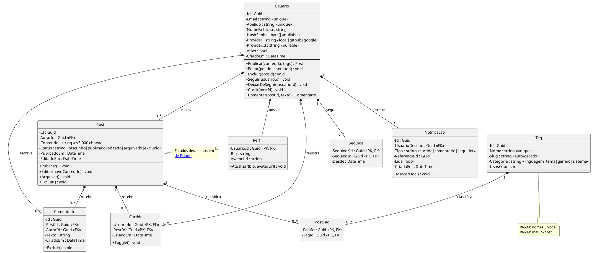

# Modelo de Domínio (UML)

> [!info] Relação com o ER
> Este documento modela as **entidades de negócio** e seus relacionamentos. A implementação relacional detalhada vive em [[02 Modelagem/Modelo de Dados (ER)|Modelo de Dados (ER)]].

## Diagrama de classes

## Entidades e regras de negócio

| Entidade | Responsabilidade | RN aplicável |
|---|---|---|
| [[#Usuario\|Usuario]] | Conta, credenciais, estado ativo/inativo, provedor OAuth | [[01 Requisitos/Regras de Negócio\|RN-03]] (unicidade), [[01 Requisitos/Regras de Negócio\|RN-10]] (OAuth sem senha) |
| [[#Perfil\|Perfil]] | Dados de exibição (1:1 com Usuario) | — |
| [[#Post\|Post]] | Publicação de texto; máquina de estados em [[02 Modelagem/Máquinas de Estado]] | [[01 Requisitos/Regras de Negócio\|RN-01]] (autoria), [[01 Requisitos/Regras de Negócio\|RN-06]] (500 chars) |
| [[#Comentario\|Comentario]] | Resposta a um Post | [[01 Requisitos/Regras de Negócio\|RN-01]] |
| [[#Curtida\|Curtida]] | Marcação positiva única por usuário/post | [[01 Requisitos/Regras de Negócio\|RN-02]] (toggle) |
| [[#Seguida\|Seguida]] | Relação direcionada seguidor → seguido | [[01 Requisitos/Regras de Negócio\|RN-05]] (auto-seguimento) |
| [[#Notificacao\|Notificacao]] | Eventos para o destinatário | [[01 Requisitos/Requisitos Funcionais\|RF-011]] |
| [[#Tag\|Tag]] | Classificador de conteúdo por tema/hobby | [[01 Requisitos/Regras de Negócio\|RN-08]] (nomes únicos), [[01 Requisitos/Regras de Negócio\|RN-09]] (máx. 5/post) |
| [[#PostTag\|PostTag]] | Relação N:N post-tag | — |

## Detalhes das entidades

### Usuario
- **Identificador:** `Id` (UUID)
- **Constraints:** `Email` único, `Apelido` único (RN-03)
- **Provider:** `local` | `github` | `google` — contas OAuth têm `HashSenha` nulo (RN-10)
- **Estados:** `Ativo` / `Inativo` (exclusão anonimiza dados em 30 dias — RN-04)

### Perfil
- **Relação 1:1** com Usuario (chave `UsuarioId` FK)
- Contém apenas dados de exibição: bio e URL do avatar

### Post
- **Estados:** Rascunho → Publicado → Editado / Arquivado / Excluído (detalhes em [[02 Modelagem/Máquinas de Estado]])
- `Conteudo` limitado a 5.000 caracteres (RN-06) — flexibilizado para blocos de código
- `Status` persistido como string no banco (detalhes em [[02 Modelagem/Modelo de Dados (ER)|ER]])

### Comentario
- Resposta a um Post; FK `PostId` e `AutorId`
- Exclusão apenas pelo autor (RN-01)

### Curtida
- PK composta: (`UsuarioId`, `PostId`)
- Toggle: curtir novamente desfaz (RN-02)

### Seguida
- PK composta: (`SeguidorId`, `SeguidoId`)
- Auto-seguimento proibido (RN-05)
- Direcionada: seguidor ≠ seguido

### Notificacao
- Tipos: `curtida`, `comentario`, `seguidor`
- `Lida` controla badge de não lidas

### Tag
- `Nome` único no sistema (RN-08)
- `Slug` auto-gerado a partir do nome
- `Categoria`: `linguagem` | `tema` | `genero` | `sistema`
- `UsosCount` mantém contagem de posts com a tag

### PostTag
- PK composta: (`PostId`, `TagId`)
- Máximo 5 tags por post (RN-09)

---

Links: [[02 Modelagem/Modelo de Dados (ER)|ER]] · [[02 Modelagem/Máquinas de Estado|Estados]] · [[02 Modelagem/Arquitetura do Sistema|Arquitetura]]
