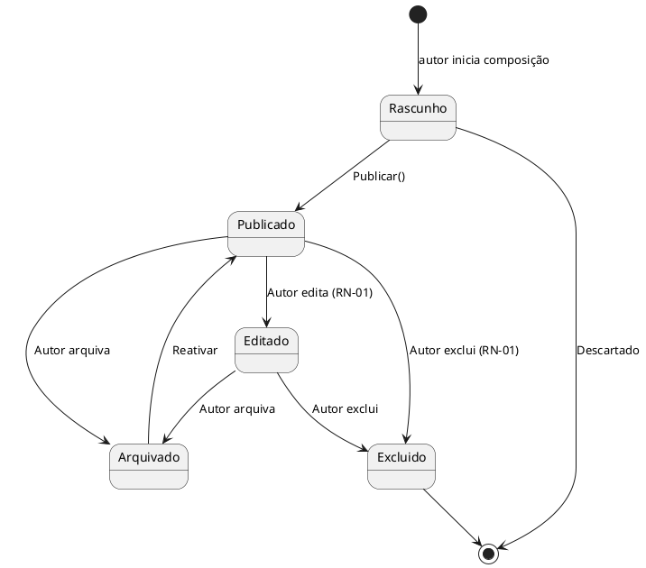
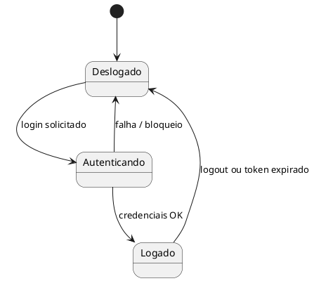
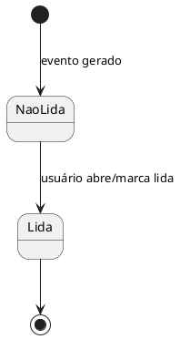

# Máquinas de Estado

> [!info] Por que modelar estados
> Evitar `if` espalhados: transições válidas ficam explícitas no domínio (RNF-12).

## Post

> [!note] Diagrama
> Estados do modelo de vida do Post via PlantUML state. `[*]` = inicial/final. `: rótulo` = transição.

| Estado | Visível no feed? | Aceita curtida/comentário? |
|---|:-:|:-:|
| Rascunho | ❌ | ❌ |
| Publicado | ✔ | ✔ |
| Editado | ✔ | ✔ |
| Arquivado | só no perfil do autor | ❌ |
| Excluído | ❌ (soft delete) | ❌ |

## Sessão de usuário

> [!note] OAuth
> Para contas OAuth (RF-024/RF-025), o fluxo "Autenticando" envolve redirecionamento para o navegador do provedor. O estado resultante é o mesmo: `Logado` com JWT.

## Notificação

## Regras de transição implementadas no Domínio
- `Post.Publicar()` só a partir de `Rascunho` (lança exceção caso contrário)
- `Excluir()` exige `Usuario.Id == Post.AutorId` ([[01 Requisitos/Regras de Negócio|RN-01]])
- Estados persistidos como `string` na coluna `status` ([[02 Modelagem/Modelo de Dados (ER)|ER]])

---
Links: [[02 Modelagem/Modelo de Domínio|Domínio]] · [[01 Requisitos/Casos de Uso|UC-04]]
