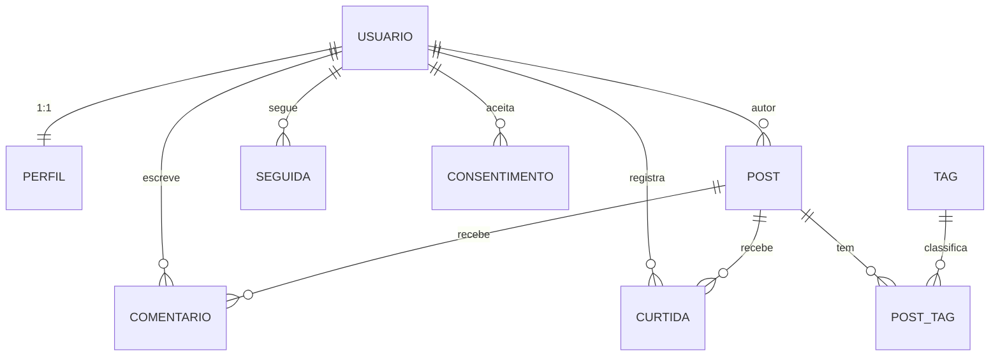
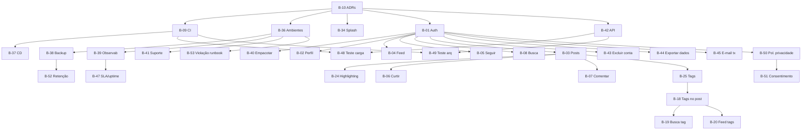

# Definição do MVP (Fase 1)

> [!info] Propósito
> Esta nota consolida **tudo** que compõe o MVP de Agora em um único lugar: RFs, RNFs, RNs, UCs, ADRs, backlog e critérios de aceitação.

## 1. Visão geral

**Objetivo:** App desktop funcional para 20 betas internos, com feed, posts com markdown/tags, interações sociais e busca.

**Prazo estimado:** Fase 1 de set–dez/2026 (~3 meses) — ver [[04 Gestão/Roadmap|Roadmap]].

**Stack decidida:**
- [[03 Decisões/ADR-001 Stack Tecnológica|ADR-001]]: Avalonia UI + .NET 10 LTS + MVVM
- [[03 Decisões/ADR-002 Implantação|ADR-002]]: Cliente-servidor
- [[03 Decisões/ADR-003 Persistência|ADR-003]]: EF Core 10
- [[03 Decisões/ADR-004 Ambientes|ADR-004]]: Ambientes dev/staging/prod
- [[03 Decisões/ADR-005 API do Servidor|ADR-005]]: API REST (ASP.NET Core) + JWT

## 2. RFs do MVP (19)

| #   | ID     | Requisito                                                                                         | Módulo     | UC    |
| --- | ------ | ------------------------------------------------------------------------------------------------- | ---------- | ----- |
| 1   | RF-001 | O sistema deve permitir cadastro com e-mail + senha, validando e-mail único                       | Conta      | UC-01 |
| 2   | RF-002 | O sistema deve permitir autenticação (login/logout) e recuperação de senha por e-mail             | Conta      | UC-02 |
| 3   | RF-003 | O sistema deve manter perfil editável com: nome de exibição, @apelido único, avatar, bio           | Conta      | UC-03 |
| 4   | RF-004 | O usuário autenticado pode publicar posts com markdown (negrito, listas, código inline, blocos de código com syntax highlighting — ver RF-022) | Conteúdo | UC-04 |
| 5   | RF-005 | O sistema deve exibir feed cronológico com posts dos usuários seguidos + próprios, paginado        | Conteúdo   | UC-05 |
| 6   | RF-006 | O autor pode editar ou excluir seus próprios posts ([[01 Requisitos/Regras de Negócio\|RN-01]])   | Conteúdo   | UC-04 |
| 7   | RF-007 | O usuário pode seguir e deixar de seguir qualquer outro usuário                                   | Social     | UC-06 |
| 8   | RF-008 | O usuário pode curtir posts (1 curtida por usuário/post)                                          | Social     | UC-07 |
| 9   | RF-009 | O usuário pode comentar posts; autor do post ou do comentário pode excluí-lo                      | Social     | UC-07 |
| 10  | RF-010 | O sistema deve permitir busca por usuários (@apelido/nome) e posts (palavra-chave)                | Descoberta | UC-08 |
| 11  | RF-016 | O usuário pode adicionar 1–5 tags de conteúdo ao post (ex: `csharp`, `dnd`, `fantasia`)           | Conteúdo   | UC-04 |
| 12  | RF-017 | O sistema deve permitir busca por tag, filtrando feed e resultados                                | Descoberta | UC-08 |
| 13  | RF-018 | O sistema deve exibir seção alternativa no feed: no MVP, ordenada por tags mais populares; na Fase 2, por tags que o usuário segue (requer RF-019) | Conteúdo | UC-05 |
| 14  | RF-022 | O sistema deve renderizar blocos de código com syntax highlighting, detectando a linguagem a partir da tag do fence markdown (ex: ` ```csharp `) | Conteúdo | UC-04 |
| 15  | RF-023 | O sistema deve exigir campo `categoria` obrigatório nas tags (`linguagem`, `tema`, `genero`, `sistema`) para alimentar filtros e sugestões | Descoberta | UC-04 |
| 16  | RF-031 | O sistema deve exibir tela de splash/loading com logo (letter metálica + partes azuis) ao iniciar: flash no metal + energia cristalina nas partes azuis | UI | UC-01 |
| 17  | RF-032 | O sistema deve permitir ao usuário excluir a própria conta, com anonimização dos dados pessoais em até 30 dias e escolha entre remover ou manter anônimos os seus posts ([[01 Requisitos/Regras de Negócio\|RN-04]]) | Conta | UC-10 |
| 18  | RF-033 | O sistema deve permitir ao usuário exportar os próprios dados pessoais em formato legível (conformidade [[01 Requisitos/Requisitos Não Funcionais#RNF-09\|RNF-09]]/LGPD) | Conta     | UC-10 |
| 19  | RF-034 | O sistema deve registrar o aceite da Política de Privacidade e dos Termos de Uso no cadastro e durante atualizações da política, guardando data/hora e versão aceita; o usuário deve poder revogar o consentimento a qualquer momento ([[01 Requisitos/Regras de Negócio\|RN-04]]) | Conta | UC-10 |

## 3. RNFs críticos para o MVP

| ID | Requisito | Meta |
|---|---|---|
| RNF-01 | Tempo de carregamento do feed (primeira página) | ≤ 2 s (P95) |
| RNF-02 | Inicialização do app até tela de login/feed | ≤ 3 s em HDD comum ⚠️ |
| RNF-03 | Ações (curtir, comentar, seguir) com feedback visual | ≤ 200 ms |
| RNF-06 | Senhas armazenadas com hash adaptativo (bcrypt/PBKDF2/Argon2), nunca em texto puro | bcrypt cost ≥ 10 (OWASP) |
| RNF-08 | Proteção contra força bruta (limitação de tentativas de login) | ≤ 5 tentativas falhas → bloqueio ≥ 15 min |
| RNF-09 | Conformidade LGPD: consentimento, exportação e exclusão de dados do usuário ([[01 Requisitos/Regras de Negócio\|RN-04]]) | Solicitações (exportar/excluir) ≤ 15 dias (LGPD art. 19) |
| RNF-10 | Windows 10+ como alvo primário; arquitetura não pode impedir Linux/macOS futuros ([[03 Decisões/ADR-001 Stack Tecnológica\|ADR-001]]) | — (restrição arquitetural) |
| RNF-11 | .NET LTS (10+) como runtime | .NET 10 LTS até nov/2028 |
| RNF-12 | Código em camadas ([[02 Modelagem/Arquitetura do Sistema\|Arquitetura]]): UI, Aplicação, Domínio, Infra | 0 violações de dependência (teste de arquitetura no CI) |
| RNF-13 | Cobertura de testes ≥ 60% no núcleo de domínio ⚠️ | ≥ 60% no núcleo de domínio ⚠️ |
| RNF-14 | CI executando build + testes a cada push | Build + testes ≤ 10 min ⚠️ |
| RNF-17 | Renderização de blocos de código com syntax highlighting completa em ≤ 100 ms (P95) para blocos de até 50 linhas | ≤ 100 ms (P95) para blocos até 50 linhas |
| RNF-18 | Animações e transições de tela (splash, loading, transições entre telas) | 60 fps; splash ≤ 3s; transições ≤ 300 ms |
| RNF-19 | Múltiplos ambientes (dev / staging / produção) isolados | 3 ambientes ([[03 Decisões/ADR-004 Ambientes\|ADR-004]]) |
| RNF-20 | Deploy automatizado com pipeline (CI/CD) | Deploy p/ staging automático; prod via aprovação |
| RNF-21 | Backup e restauração do banco de produção | Backup diário; restore testado |
| RNF-22 | Observabilidade: logs, métricas, health checks, alertas | Logs estruturados (Serilog) + health checks no MVP; métricas expostas em formato Prometheus (OTLP); dashboards/alertas (Prometheus + Grafana) na Fase 2 — [[03 Decisões/ADR-006 Observabilidade\|ADR-006]] |
| RNF-23 | Empacotamento/distribuição do app desktop — formato **MSIX** (compatível com sideload e possível publicação na Microsoft Store) | Installer MSIX + identidade de pacote; atualização via Store (opcional) |
| RNF-24 | SLA de disponibilidade do servidor — uptime mensal da **produção** | **≥ 99,5%** ao mês; **exclui janelas de manutenção programadas** (agendadas e comunicadas); medido via health checks/uptime monitoring (RNF-22); detalhes e compensação em [[04 Gestão/SLA de Disponibilidade\|SLA de Disponibilidade]] — escopo: produção apenas |
| RNF-25 | Throughput do servidor — taxa de requisições por segundo sustentada | **≥ 50 req/s** sustentados (cenário de leitura: feed, busca, detalhe de post), **sem degradar RNF-01/03**; validado por teste de carga automatizado no CI (ferramenta candidata: **NBomber** ⚠️) |
| RNF-26 | Alinhamento com princípios GDPR (minimização, limitação de armazenamento, accountability, notificação de violação) — GDPR não aplicável hoje ([[01 Requisitos/LGPD e Privacidade\|LGPD e Privacidade]]) | Consentimento registrado (data/versão); retenção: dados/backups ≤ 30 d; notificação ≤ 72 h da ciência ⚠️ |

## 4. RNs aplicáveis ao MVP

| ID | Regra |
|---|---|
| RN-01 | Somente o autor edita/exclui post/comentário |
| RN-02 | Máx. 1 curtida por usuário/post (toggle) |
| RN-03 | E-mail e @apelido únicos |
| RN-04 | Exclusão de conta anonimiza dados em ≤ 30 dias |
| RN-05 | Auto-seguimento proibido |
| RN-06 | Posts ≤ 5.000 caracteres |
| RN-07 | Feed cronológico, sem algoritmo |
| RN-08 | Tags: nomes únicos, slug auto-gerado |
| RN-09 | Máx. 5 tags por post |
| RN-11 | Retenção: dados anonimizados ≤ 30 d; backups ≤ 30 d; dados no Brasil |
| RN-12 | Violação de dados: notificar ANPD/titulares ≤ 72 h; registrar incidente |

## 5. Backlog do MVP (33 itens)

| ID | Item | Esforço | Depende de |
|---|---|:-:|---|
| B-10 | ADRs críticos (stack + implantação) | S | — |
| B-09 | Setup CI build+testes | S | B-10 |
| B-36 | Política de ambientes dev/staging/prod | M | B-10 |
| B-37 | Pipeline CD (deploy automático staging; prod via aprovação) | M | B-09 |
| B-34 | Tela de splash: logo letter metálica (flash) + azul (energia cristalina) | S | B-10 |
| B-01 | Cadastro/login/logout + recuperação de senha | M | B-10 |
| B-02 | CRUD perfil básico | S | B-01 |
| B-03 | Publicar post com markdown | M | B-01 |
| B-24 | Syntax highlighting em code blocks | M | B-03 |
| B-04 | Feed cronológico paginado | L | B-01 |
| B-05 | Seguir/deixar de seguir | M | B-01 |
| B-06 | Curtir post (toggle) | S | B-03 |
| B-07 | Comentar/excluir comentário | M | B-03 |
| B-08 | Busca por usuários e posts | M | B-01 |
| B-25 | Tags com categoria | M | B-03 |
| B-18 | Adicionar 1–5 tags ao post | L | B-25 |
| B-19 | Busca por tag | M | B-18 |
| B-20 | Feed por tags populares | M | B-18 |
| B-38 | Backup + restore do banco de produção | M | B-36 |
| B-39 | Observabilidade (logs, métricas, health checks, alertas) | M | B-36 |
| B-40 | Empacotamento MSIX (installer + sideload; habilita opção Store) | M | B-01 |
| B-41 | Documentação de suporte (runbook, rollback) | S | B-36 |
| B-42 | Skeleton da API: ASP.NET Core Web API + auth JWT + OpenAPI | M | B-10 |
| B-43 | Exclusão de conta (remover/anonimizar posts) | M | B-01 |
| B-44 | Exportação de dados pessoais | S | B-01 |
| B-45 | E-mail transacional (recuperação de senha) | S | B-01 |
| B-47 | Medição/verificação do SLA de disponibilidade (uptime da produção — RNF-24) | S | B-39 |
| B-48 | Teste de carga + benchmark de throughput (≥ 50 req/s) no CI | M | B-09, B-42 |
| B-49 | Teste de arquitetura (0 violações de dependência entre camadas — regras do RNF-12) no CI | S | B-09, B-42 |
| B-50 | Política de Privacidade + Termos de Uso (aceite no cadastro) | S | B-01 |
| B-51 | Registro e revogação do consentimento (data/hora + versão da política) | S | B-50 |
| B-52 | Política de retenção: anonimizar ≤ 30 d + backups ≤ 30 d + residência BR | S | B-38 |
| B-53 | Runbook de notificação de violação de dados pessoais | S | B-36 |

### 5.1 Modelo de dados (MER — Fase 1)

> Diagrama conceitual das entidades do MVP; detalhes físicos (índices, constraints) e Fases 2/3 em [[02 Modelagem/Modelo de Dados (ER)|Modelo de Dados (ER)]].



## 6. Diagrama de dependências



## 7. Critérios de aceitação do MVP

| Critério | Como validar |
|---|---|
| Cadastro/logout funciona | Criar conta, login, logout, esqueci senha |
| Splash animada aparece | Logo animada ao iniciar; ≤ 3s; transição suave |
| Perfil editável | Alterar nome, @, avatar, bio |
| Post com markdown | Publicar com negrito, listas, código, code block |
| Syntax highlighting | Code block em C# renderiza colorido |
| Feed cronológico | Ver posts dos seguidos + próprios em ordem |
| Feed por tags | Aba "Popular" mostra posts das tags mais usadas |
| Seguir/deixar de seguir | Seguir usuário aparece no feed; deixar de seguir remove |
| Curtir (toggle) | Curtir conta; curtir de novo desfaz |
| Comentar | Comentar em post; autor pode excluir |
| Busca | Buscar por @, nome, palavra-chave, tag |
| Tags | Adicionar 1–5 tags; buscar por tag |
| Performance | Feed ≤ 2 s (P95); highlighting ≤ 100 ms; throughput ≥ 50 req/s no teste de carga do CI (RNF-25) |
| Excluir conta | Excluir conta escolhendo remover/anonimizar posts; dados anonimizados ≤ 30 dias |
| Exportar dados | Solicitar exportação e receber arquivo legível |
| Consentimento registrado | Aceite da política no cadastro guarda data/hora + versão; revogação disponível |
| CI | Build + testes passam no push |
| API autenticada | Login retorna JWT; requests autenticados funcionam; OpenAPI disponível |

## 8. O que NÃO está no MVP

| Feature | Prioridade | Quando |
|---|---|---|
| Notificações in-app | Should | Fase 2 |
| Upload de mídia | Should | Fase 2 |
| Mensagens diretas | Should | Fase 2 |
| Seguir tags | Should | Fase 2 |
| Flair de perfil | Should | Fase 2 |
| Perfil expandido | Should | Fase 2 |
| OAuth GitHub | Should | Fase 2 |
| Contas privadas | Could | Fase 3 |
| Moderação | Could | Fase 3 |
| OAuth Google | Could | Fase 3 |
| Biblioteca de livros | Could | Fase 3 |
| Repos GitHub | Could | Fase 3 |
| Jogos jogados | Could | Fase 3 |
| Mesas/campanhas RPG | Could | Fase 3 |
| Séries de posts | — | Demanda futura (funcionalidade descartada) |
| Coleções de posts | — | Demanda futura (funcionalidade descartada) |

---

Links: [[04 Gestão/Roadmap|Roadmap]] · [[04 Gestão/Backlog do Produto|Backlog]] · [[Resumo dos Requisitos]] · [[01 Requisitos/Visão do Produto|Visão]]
