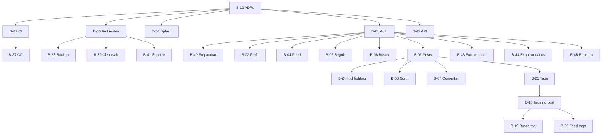

# Definição do MVP (Fase 1)

> [!info] Propósito
> Esta nota consolida **tudo** que compõe o MVP de Agora em um único lugar: RFs, RNFs, RNs, UCs, ADRs, backlog e critérios de aceitação.

## 1. Visão geral

**Objetivo:** App desktop funcional para 20 betas internos, com feed, posts com markdown/tags, interações sociais e busca.

**Prazo estimado:** Fase 1 de set–dez/2026 (~3 meses) — ver [[04 Gestão/Roadmap|Roadmap]].

**Stack decidida:**
- [[03 Decisões/ADR-001 Stack Tecnológica|ADR-001]]: Avalonia UI + .NET 10 LTS + MVVM
- [[03 Decisões/ADR-002 Implantação|ADR-002]]: Cliente-servidor
- [[03 Decisões/ADR-003 Persistência|ADR-003]]: EF Core 10
- [[03 Decisões/ADR-004 Ambientes|ADR-004]]: Ambientes dev/staging/prod
- [[03 Decisões/ADR-005 API do Servidor|ADR-005]]: API REST (ASP.NET Core) + JWT

## 2. RFs do MVP (18)

| #   | ID     | Requisito                                                                                         | Módulo     | UC    |
| --- | ------ | ------------------------------------------------------------------------------------------------- | ---------- | ----- |
| 1   | RF-001 | Cadastro com e-mail + senha, validando e-mail único                                               | Conta      | UC-01 |
| 2   | RF-002 | Autenticação (login/logout) + recuperação de senha por e-mail                                     | Conta      | UC-02 |
| 3   | RF-003 | Perfil editável: nome de exibição, @apelido único, avatar, bio                                    | Conta      | UC-03 |
| 4   | RF-004 | Publicar posts com markdown (texto + code blocks)                                                 | Conteúdo   | UC-04 |
| 5   | RF-005 | Feed cronológico (seguidos + próprios), paginado                                                  | Conteúdo   | UC-05 |
| 6   | RF-006 | Autor edita ou exclui seus próprios posts                                                         | Conteúdo   | UC-04 |
| 7   | RF-007 | Seguir / deixar de seguir qualquer usuário                                                        | Social     | UC-06 |
| 8   | RF-008 | Curtir posts (1 curtida por usuário/post, toggle)                                                 | Social     | UC-07 |
| 9   | RF-009 | Comentar posts; exclusão pelo autor                                                               | Social     | UC-07 |
| 10  | RF-010 | Busca por usuários (@apelido/nome) e posts (palavra-chave)                                        | Descoberta | UC-08 |
| 11  | RF-016 | Adicionar 1–5 tags de conteúdo ao post                                                            | Conteúdo   | UC-04 |
| 12  | RF-017 | Busca por tag, filtrando feed e resultados                                                        | Descoberta | UC-08 |
| 13  | RF-018 | Feed alternativo por tags populares (MVP); por tags seguidas (Fase 2)                             | Conteúdo   | UC-05 |
| 14  | RF-022 | Syntax highlighting em blocos de código                                                           | Conteúdo   | UC-04 |
| 15  | RF-023 | Campo `categoria` obrigatório nas tags                                                            | Descoberta | UC-04 |
| 16  | RF-031 | Tela de splash com logo (letter metálica + partes azuis): flash no metal + energia cristalina     | UI         | UC-01 |
| 17  | RF-032 | Excluir própria conta, anonimizando dados em ≤ 30 dias, com remoção/anonimização dos posts (LGPD) | Conta      | UC-10 |
| 18  | RF-033 | Exportar os próprios dados pessoais em formato legível (LGPD)                                     | Conta      | UC-10 |

## 3. RNFs críticos para o MVP

| ID | Requisito | Meta |
|---|---|---|
| RNF-01 | Tempo de carregamento do feed | ≤ 2 s (P95) |
| RNF-02 | Inicialização do app até tela de login | ≤ 3 s |
| RNF-03 | Tempo de resposta do servidor | ≤ 200 ms (P95) |
| RNF-06 | Hash de senha | bcrypt/argon2 |
| RNF-08 | Proteção contra força bruta | Limitação de tentativas |
| RNF-09 | LGPD: consentimento, exportação e exclusão de dados | Anonimização ≤ 30 dias; exportação legível (RF-032/033) |
| RNF-10 | Portabilidade | Windows primeiro, sem bloquear Linux/macOS |
| RNF-11 | Suporte LTS | .NET 10 até nov/2028 |
| RNF-12 | Arquitetura camadas | 4 camadas, testabilidade |
| RNF-13 | Cobertura de testes no domínio | ≥ 60% |
| RNF-14 | CI | Build + testes automatizados |
| RNF-17 | Syntax highlighting | ≤ 100 ms (P95) para blocos ≤ 50 linhas |
| RNF-18 | Animações e transições | 60 fps; splash ≤ 3s; transições ≤ 300 ms |
| RNF-19 | Ambientes dev/staging/prod | 3 ambientes isolados |
| RNF-20 | Deploy automatizado (CI/CD) | Staging automático; prod via aprovação |
| RNF-21 | Backup do banco de produção | Backup diário; restore testado |
| RNF-22 | Observabilidade | Logs, métricas, health checks, alertas |
| RNF-23 | Empacotamento/entrega | MSIX (installer + sideload; opção futura Microsoft Store) |

## 4. RNs aplicáveis ao MVP

| ID | Regra |
|---|---|
| RN-01 | Somente o autor edita/exclui post/comentário |
| RN-02 | Máx. 1 curtida por usuário/post (toggle) |
| RN-03 | E-mail e @apelido únicos |
| RN-04 | Exclusão de conta anonimiza dados em ≤ 30 dias |
| RN-05 | Auto-seguimento proibido |
| RN-06 | Posts ≤ 5.000 caracteres |
| RN-07 | Feed cronológico, sem algoritmo |
| RN-08 | Tags: nomes únicos, slug auto-gerado |
| RN-09 | Máx. 5 tags por post |

## 5. Backlog do MVP (26 itens)

| ID | Item | Esforço | Depende de |
|---|---|:-:|---|
| B-10 | ADRs críticos (stack + implantação) | S | — |
| B-09 | Setup CI build+testes | S | B-10 |
| B-36 | Política de ambientes dev/staging/prod | M | B-10 |
| B-37 | Pipeline CD (deploy automático staging; prod via aprovação) | M | B-09 |
| B-34 | Tela de splash: logo letter metálica (flash) + azul (energia cristalina) | S | B-10 |
| B-01 | Cadastro/login/logout + recuperação de senha | M | B-10 |
| B-02 | CRUD perfil básico | S | B-01 |
| B-03 | Publicar post com markdown | M | B-01 |
| B-24 | Syntax highlighting em code blocks | M | B-03 |
| B-04 | Feed cronológico paginado | L | B-01 |
| B-05 | Seguir/deixar de seguir | M | B-01 |
| B-06 | Curtir post (toggle) | S | B-03 |
| B-07 | Comentar/excluir comentário | M | B-03 |
| B-08 | Busca por usuários e posts | M | B-01 |
| B-25 | Tags com categoria | M | B-03 |
| B-18 | Adicionar 1–5 tags ao post | L | B-25 |
| B-19 | Busca por tag | M | B-18 |
| B-20 | Feed por tags populares | M | B-18 |
| B-38 | Backup + restore do banco de produção | M | B-36 |
| B-39 | Observabilidade (logs, métricas, health checks, alertas) | M | B-36 |
| B-40 | Empacotamento MSIX (installer + sideload; habilita opção Store) | M | B-01 |
| B-41 | Documentação de suporte (runbook, rollback) | S | B-36 |
| B-42 | Skeleton da API: ASP.NET Core Web API + auth JWT + OpenAPI | M | B-10 |
| B-43 | Exclusão de conta (remover/anonimizar posts) | M | B-01 |
| B-44 | Exportação de dados pessoais | S | B-01 |
| B-45 | E-mail transacional (recuperação de senha) | S | B-01 |

## 6. Diagrama de dependências

## 7. Critérios de aceitação do MVP

| Critério | Como validar |
|---|---|
| Cadastro/logout funciona | Criar conta, login, logout, esqueci senha |
| Splash animada aparece | Logo animada ao iniciar; ≤ 3s; transição suave |
| Perfil editável | Alterar nome, @, avatar, bio |
| Post com markdown | Publicar com negrito, listas, código, code block |
| Syntax highlighting | Code block em C# renderiza colorido |
| Feed cronológico | Ver posts dos seguidos + próprios em ordem |
| Feed por tags | Aba "Popular" mostra posts das tags mais usadas |
| Seguir/deixar de seguir | Seguir usuário aparece no feed; deixar de seguir remove |
| Curtir (toggle) | Curtir conta; curtir de novo desfaz |
| Comentar | Comentar em post; autor pode excluir |
| Busca | Buscar por @, nome, palavra-chave, tag |
| Tags | Adicionar 1–5 tags; buscar por tag |
| Performance | Feed ≤ 2 s (P95); highlighting ≤ 100 ms |
| Excluir conta | Excluir conta escolhendo remover/anonimizar posts; dados anonimizados ≤ 30 dias |
| Exportar dados | Solicitar exportação e receber arquivo legível |
| CI | Build + testes passam no push |
| API autenticada | Login retorna JWT; requests autenticados funcionam; OpenAPI disponível |

## 8. O que NÃO está no MVP

| Feature | Prioridade | Quando |
|---|---|---|
| Notificações in-app | Should | Fase 2 |
| Upload de mídia | Should | Fase 2 |
| Mensagens diretas | Should | Fase 2 |
| Seguir tags | Should | Fase 2 |
| Flair de perfil | Should | Fase 2 |
| Perfil expandido | Should | Fase 2 |
| OAuth GitHub | Should | Fase 2 |
| Contas privadas | Could | Fase 3 |
| Moderação | Could | Fase 3 |
| OAuth Google | Could | Fase 3 |
| Biblioteca de livros | Could | Fase 3 |
| Repos GitHub | Could | Fase 3 |
| Jogos jogados | Could | Fase 3 |
| Mesas/campanhas RPG | Could | Fase 3 |
| Séries de posts | — | Demanda futura (funcionalidade descartada) |
| Coleções de posts | — | Demanda futura (funcionalidade descartada) |

---

Links: [[04 Gestão/Roadmap|Roadmap]] · [[04 Gestão/Backlog do Produto|Backlog]] · [[Resumo dos Requisitos]] · [[01 Requisitos/Visão do Produto|Visão]]
