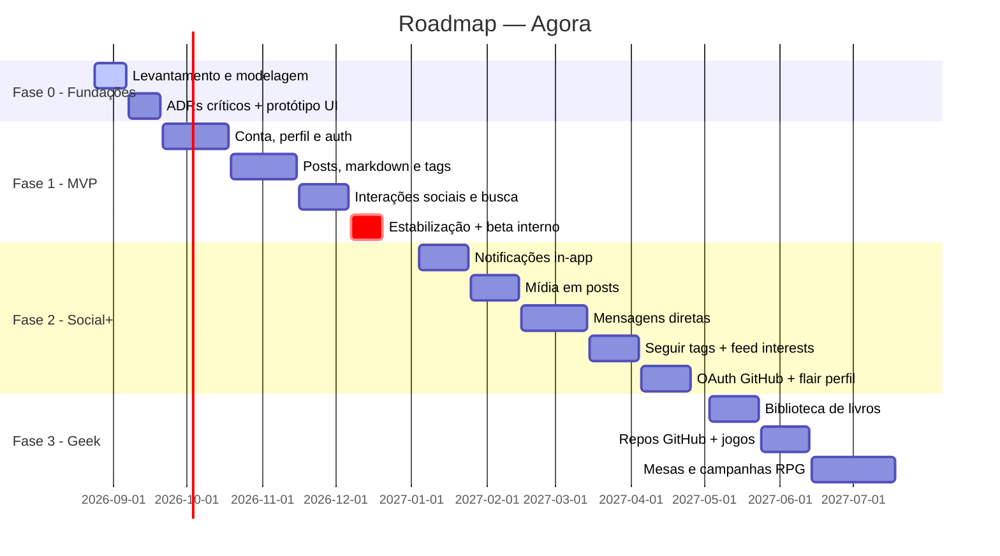

# Roadmap

> [!warning] Datas são estimativas ⚠️ — revisar após Fase 0.

## Marcos (milestones)

| Marco | Critério de saída | Data alvo |
|---|---|---|
| M0 — Modelagem aprovada | Vault revisado; ADRs 001/002/003/004/005 aceitos | set/2026 |
| M1 — MVP funcional | 16 RFs + 17 RNFs críticos entregues | dez/2026 |
| M2 — Beta externo | 20 usuários ativos (OKR O2) | jan/2027 |
| M3 — Fase 2 completa | Notificações, mídia, DMs, seguir tags, OAuth, flair | abr/2027 |
| M4 — Fase 3 completa | Livros, GitHub, jogos, RPG | jul/2027 |

## Detalhamento por fase

### Fase 0 — Fundações (ago–set/2026)
- [x] Levantamento de requisitos
- [x] Modelagem de domínio, ER, estados, fluxos
- [x] ADR-001: Avalonia + .NET 10 ✅
- [x] ADR-002: Cliente-servidor ✅
- [x] ADR-003: EF Core 10 ✅
- [x] ADR-004: Ambientes dev/staging/prod ✅
- [x] ADR-005: API do servidor (REST + JWT) ✅
- [ ] Setup CI build+testes (B-09)

### Fase 1 — MVP (set–dez/2026)
- **Conta/Perfil/Auth:** RF-001, RF-002, RF-003
- **Posts/Conteúdo:** RF-004, RF-005, RF-006, RF-016, RF-018, RF-022, RF-023
- **Social:** RF-007, RF-008, RF-009
- **UI/Experiência:** RF-031
- **Descoberta:** RF-010, RF-017
- **Infra/Entrega:** ambientes (ADR-004), CI/CD, backup, observabilidade, empacotamento (B-36..B-41) + skeleton da API com auth JWT/OpenAPI (B-42) — ver [[04 Gestão/Operações e Deploy|Operações e Deploy]]
- Detalhes → [[04 Gestão/Definição do MVP|Definição do MVP]]

### Fase 2 — Social+ (jan–abr/2027)
- Notificações in-app (RF-011)
- Upload de mídia (RF-012)
- Mensagens diretas (RF-013)
- Seguir tags + feed por interesses (RF-019)
- Flair de perfil (RF-020)
- Perfil expandido (RF-021)
- OAuth GitHub (RF-024)

### Fase 3 — Geek (mai–jul/2027)
- OAuth Google (RF-025)
- Vincular provedores (RF-026)
- Biblioteca de livros (RF-027)
- Repos GitHub (RF-028)
- Jogos jogados (RF-029)
- Mesas/campanhas RPG (RF-030)
- Contas privadas (RF-014)
- Moderação (RF-015)

---

Links: [[04 Gestão/Backlog do Produto|Backlog]] · [[04 Gestão/Definição do MVP|MVP]] · [[Resumo dos Requisitos]]
