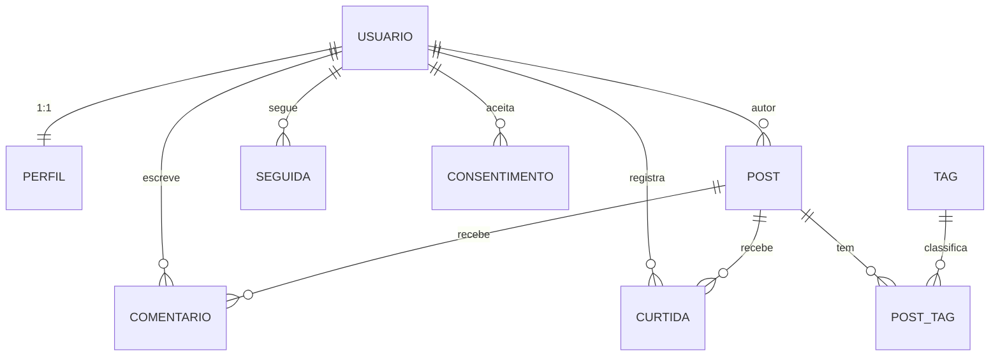

# Verificação da Primeira Entrega

> [!info] Propósito
> Resposta aos 5 tópicos de "O que o Levantamento deve Contemplar?" do enunciado da primeira entrega ([[PRIMEIRA ENTREGA - Requisitos]]). Material de apoio à **apresentação**: cada tópico indica estágio (pronto/consistente/parcial), os **RNFs do MVP** e as **ferramentas** usadas para sustentar as metas.

## 1. Requisitos Funcionais (RF) — ✅ Pronto e consistente

- **34 RFs** documentados em [[01 Requisitos/Requisitos Funcionais]] (19 **Must = MVP**, 7 **Should = Fase 2**, 8 **Could = Fase 3**).
- Cada RF tem **prioridade MoSCoW** e **caso de uso vinculado** (rastreabilidade RF → UC verificada: 23/23 ✅).
- **Critérios de aceite:** os 10 casos de uso estruturados (ator, pré-condição, fluxo principal, alternativos, exceções, pós-condição — [[01 Requisitos/Casos de Uso]]) + tabela "Critérios de aceitação do MVP" ([[04 Gestão/Definição do MVP#7. Critérios de aceitação do MVP]]).
- Consistente com o resumo geral [[Resumo dos Requisitos]] (contadores batem) e com o backlog ([[04 Gestão/Backlog do Produto]]).

### RFs do MVP (19 Must)

| ID | Descrição | Caso de uso (critério de aceite) |
|---|---|---|
| RF-001 | O sistema deve permitir cadastro com e-mail + senha, validando e-mail único | [[01 Requisitos/Casos de Uso#UC-01 — Cadastrar conta\|UC-01]] |
| RF-002 | O sistema deve permitir autenticação (login/logout) e recuperação de senha por e-mail | [[01 Requisitos/Casos de Uso#UC-02 — Autenticar\|UC-02]] |
| RF-003 | O sistema deve manter perfil editável com: nome de exibição, @apelido único, avatar, bio | [[01 Requisitos/Casos de Uso#UC-03 — Gerenciar perfil\|UC-03]] |
| RF-004 | O usuário autenticado pode publicar posts com markdown (negrito, listas, código inline, blocos de código com syntax highlighting — ver RF-022) | [[01 Requisitos/Casos de Uso#UC-04 — Publicar post\|UC-04]] |
| RF-005 | O sistema deve exibir feed cronológico com posts dos usuários seguidos + próprios, paginado | [[01 Requisitos/Casos de Uso#UC-05 — Visualizar feed\|UC-05]] |
| RF-006 | O autor pode editar ou excluir seus próprios posts ([[01 Requisitos/Regras de Negócio\|RN-01]]) | [[01 Requisitos/Casos de Uso#UC-04 — Publicar post\|UC-04]] |
| RF-007 | O usuário pode seguir e deixar de seguir qualquer outro usuário | [[01 Requisitos/Casos de Uso#UC-06 — Seguir usuário\|UC-06]] |
| RF-008 | O usuário pode curtir posts (1 curtida por usuário/post) | [[01 Requisitos/Casos de Uso#UC-07 — Interagir com post (curtir/comentar/excluir)\|UC-07]] |
| RF-009 | O usuário pode comentar posts; autor do post ou do comentário pode excluí-lo | [[01 Requisitos/Casos de Uso#UC-07 — Interagir com post (curtir/comentar/excluir)\|UC-07]] |
| RF-010 | O sistema deve permitir busca por usuários (@apelido/nome) e posts (palavra-chave) | [[01 Requisitos/Casos de Uso#UC-08 — Buscar\|UC-08]] |
| RF-016 | O usuário pode adicionar 1–5 tags de conteúdo ao post (ex: `csharp`, `dnd`, `fantasia`) | [[01 Requisitos/Casos de Uso#UC-04 — Publicar post\|UC-04]] |
| RF-017 | O sistema deve permitir busca por tag, filtrando feed e resultados | [[01 Requisitos/Casos de Uso#UC-08 — Buscar\|UC-08]] |
| RF-018 | O sistema deve exibir seção alternativa no feed: no MVP, ordenada por tags mais populares; na Fase 2, por tags que o usuário segue (requer RF-019) | [[01 Requisitos/Casos de Uso#UC-05 — Visualizar feed\|UC-05]] |
| RF-022 | O sistema deve renderizar blocos de código com syntax highlighting, detectando a linguagem a partir da tag do fence markdown (ex: ` ```csharp `) | [[01 Requisitos/Casos de Uso#UC-04 — Publicar post\|UC-04]] |
| RF-023 | O sistema deve exigir campo `categoria` obrigatório nas tags (`linguagem`, `tema`, `genero`, `sistema`) para alimentar filtros e sugestões | [[01 Requisitos/Casos de Uso#UC-04 — Publicar post\|UC-04]] |
| RF-031 | O sistema deve exibir tela de splash/loading com logo (letter metálica + partes azuis) ao iniciar: flash no metal + energia cristalina nas partes azuis | [[01 Requisitos/Casos de Uso#UC-01 — Cadastrar conta\|UC-01]] |
| RF-032 | O sistema deve permitir ao usuário excluir a própria conta, com anonimização dos dados pessoais em até 30 dias e escolha entre remover ou manter anônimos os seus posts ([[01 Requisitos/Regras de Negócio\|RN-04]]) | [[01 Requisitos/Casos de Uso#UC-10 — Gerenciar dados da conta (exclusão/exportação — LGPD)\|UC-10]] |
| RF-033 | O sistema deve permitir ao usuário exportar os próprios dados pessoais em formato legível (conformidade [[01 Requisitos/Requisitos Não Funcionais#RNF-09\|RNF-09]]/LGPD) | [[01 Requisitos/Casos de Uso#UC-10 — Gerenciar dados da conta (exclusão/exportação — LGPD)\|UC-10]] |
| RF-034 | O sistema deve registrar o aceite da Política de Privacidade e dos Termos de Uso no cadastro e durante atualizações da política, guardando data/hora e versão aceita; o usuário deve poder revogar o consentimento a qualquer momento ([[01 Requisitos/Regras de Negócio\|RN-04]]) | [[01 Requisitos/Casos de Uso#UC-10 — Gerenciar dados da conta (exclusão/exportação — LGPD)\|UC-10]] |

## 2. Requisitos Não Funcionais (RNF) — ✅ Pronto e consistente

- **26 RNFs** no total; **21 críticos para o MVP** (tabela abaixo), todos com **metas mensuráveis** (critério SMART) em [[01 Requisitos/Requisitos Não Funcionais]].
- Cada meta indica a **ferramenta/mecanismo de validação** que a sustenta (coluna "Como sustentamos").

### RNFs críticos do MVP (21)

| ID | Requisito | Meta (SMART) | Como sustentamos |
|---|---|---|---|
| RNF-01 | Tempo de carregamento do feed (primeira página) | ≤ 2 s (P95) | Teste de carga **NBomber** no CI (B-48) + métricas de latência via OpenTelemetry (B-39) |
| RNF-02 | Inicialização do app até tela de login/feed | ≤ 3 s em HDD comum ⚠️ | Benchmark de inicialização do client no CI ⚠️ |
| RNF-03 | Ações (curtir, comentar, seguir) com feedback visual | ≤ 200 ms | NBomber (latência de API) + medição ponta-a-ponta no client ⚠️ |
| RNF-06 | Senhas armazenadas com hash adaptativo (bcrypt/PBKDF2/Argon2), nunca em texto puro | bcrypt cost ≥ 10 (OWASP) | Biblioteca de hashing .NET (ex.: **BCrypt.Net** ⚠️) |
| RNF-08 | Proteção contra força bruta (limitação de tentativas de login) | ≤ 5 tentativas falhas → bloqueio ≥ 15 min | Middleware **ASP.NET Core Rate Limiting** |
| RNF-09 | Conformidade LGPD: consentimento, exportação e exclusão de dados do usuário ([[01 Requisitos/Regras de Negócio\|RN-04]]) | Solicitações (exportar/excluir) ≤ 15 dias (LGPD art. 19) | Testes de integração do fluxo UC-10 (xUnit ⚠️) |
| RNF-10 | Windows 10+ como alvo primário; arquitetura não pode impedir Linux/macOS futuros ([[03 Decisões/ADR-001 Stack Tecnológica\|ADR-001]]) | — (restrição arquitetural) | Target .NET + Avalonia; validação multiplataforma ⚠️ |
| RNF-11 | .NET LTS (10+) como runtime | .NET 10 LTS até nov/2028 | Target framework do projeto |
| RNF-12 | Código em camadas ([[02 Modelagem/Arquitetura do Sistema\|Arquitetura]]): UI, Aplicação, Domínio, Infra | 0 violações de dependência (teste de arquitetura no CI) | Testes de arquitetura (ex.: **NetArchTest** ⚠️) |
| RNF-13 | Cobertura de testes ≥ 60% no núcleo de domínio ⚠️ | ≥ 60% no núcleo de domínio ⚠️ | **xUnit + Coverlet** (medição de cobertura) ⚠️ |
| RNF-14 | CI executando build + testes a cada push | Build + testes ≤ 10 min ⚠️ | **GitHub Actions** (B-09) |
| RNF-17 | Renderização de blocos de código com syntax highlighting completa em ≤ 100 ms (P95) para blocos de até 50 linhas | ≤ 100 ms (P95) para blocos até 50 linhas | Benchmark do renderer no CI (AvaloniaEdit/TextMateSharp) ⚠️ |
| RNF-18 | Animações e transições de tela (splash, loading, transições entre telas) | 60 fps; splash ≤ 3s; transições ≤ 300 ms | Auditoria visual/teste de desempenho da UI ⚠️ |
| RNF-19 | Múltiplos ambientes (dev / staging / produção) isolados | 3 ambientes ([[03 Decisões/ADR-004 Ambientes\|ADR-004]]) | Pipeline **GitHub Actions** (B-37) |
| RNF-20 | Deploy automatizado com pipeline (CI/CD) | Deploy p/ staging automático; prod via aprovação | Pipeline **GitHub Actions** (B-37) |
| RNF-21 | Backup e restauração do banco de produção | Backup diário; restore testado | **pg_dump**/PostgreSQL + restore testado (B-38) ⚠️ |
| RNF-22 | Observabilidade: logs, métricas, health checks, alertas | Logs estruturados (Serilog) + health checks no MVP; métricas expostas em formato Prometheus (OTLP); dashboards/alertas (Prometheus + Grafana) na Fase 2 — [[03 Decisões/ADR-006 Observabilidade\|ADR-006]] | **Serilog** + Health Checks + OpenTelemetry/Prometheus (B-39) |
| RNF-23 | Empacotamento/distribuição do app desktop — formato **MSIX** (compatível com sideload e possível publicação na Microsoft Store) | Installer MSIX + identidade de pacote; atualização via Store (opcional) | Windows SDK / **MSIX Packaging Tools** ⚠️ |
| RNF-24 | SLA de disponibilidade do servidor — uptime mensal da **produção** | **≥ 99,5%** ao mês; **exclui janelas de manutenção programadas** (agendadas e comunicadas); medido via health checks/uptime monitoring (RNF-22); detalhes e compensação em [[04 Gestão/SLA de Disponibilidade\|SLA de Disponibilidade]] — escopo: produção apenas | Health checks + uptime monitoring (B-47) — ver [[04 Gestão/SLA de Disponibilidade\|SLA]] |
| RNF-25 | Throughput do servidor — taxa de requisições por segundo sustentada | **≥ 50 req/s** sustentados (cenário de leitura: feed, busca, detalhe de post), **sem degradar RNF-01/03**; validado por teste de carga automatizado no CI (ferramenta candidata: **NBomber** ⚠️) | Teste de carga **NBomber** no CI (B-48, ⚠️ candidato) |
| RNF-26 | Alinhamento com princípios GDPR (minimização, limitação de armazenamento, accountability, notificação de violação) — GDPR não aplicável hoje ([[01 Requisitos/LGPD e Privacidade\|LGPD e Privacidade]]) | Consentimento registrado (data/versão); retenção ≤ 30 d (dados/backups); notificação ≤ 72 h ⚠️ | Testes de integração do consentimento (RF-034) + verificação de retenção (B-52/B-53) |

### Cobertura das categorias do enunciado

> Categorias alinhadas ao modelo de qualidade **ISO/IEC 25010:2011 (SQuaRE)** — "atributos de qualidade (ISO/IEC)" do enunciado.

| Categoria                  | Exemplos de meta                                                                                |
| -------------------------- | ----------------------------------------------------------------------------------------------- |
| Desempenho                 | Feed ≤ 2 s (P95) · inicialização ≤ 3 s · feedback ≤ 200 ms · **throughput ≥ 50 req/s (RNF-25)** |
| Disponibilidade            | SLA ≥ 99,5% uptime mensal da produção (RNF-24) · manutenção programada excluída                 |
| Usabilidade/Acessibilidade | 100% ações via teclado · contraste WCAG AA ≥ 4.5:1                                              |
| Segurança                  | Hash adaptativo (RNF-06) · TLS 1.2+ (RNF-07) · bloqueio força bruta (RNF-08)                    |
| Privacidade                | LGPD: consentimento, exportação, exclusão (RNF-09) · princípios GDPR (RNF-26)                   |
| Manutenibilidade           | Cobertura de testes ≥ 60% no domínio (RNF-13) · CI a cada push (RNF-14)                         |
| Operação                   | 3 ambientes (RNF-19) · deploy staging automático + prod via aprovação (RNF-20)                  |

> [!note] Conformidade LGPD/GDPR
> Conformidade citada no enunciado: o projeto documenta **LGPD** (RNF-09) + princípios **GDPR** (RNF-26). GDPR **não é aplicável hoje** (sem titulares/estabelecimento na UE) — justificativa e alinhamento em [[01 Requisitos/LGPD e Privacidade#1. Leis aplicáveis|LGPD e Privacidade]].

> [!note] Ferramentas confirmadas × candidatas
> Confirmadas: **Serilog** (RNF-16/22), **GitHub Actions** (B-09/B-37), **EF Core** (ADR-003), **Npgsql** (ADR-007), **Health Checks** ASP.NET Core (B-39). Candidatas ⚠️ (validar em spike antes de fixar): **NBomber** (B-48), **xUnit + Coverlet**, **NetArchTest**, **BCrypt.Net**, **pg_dump**, **MSIX Packaging Tools**.

## 3. Modelagem de Dados — DER/MER — ✅ Pronto e consistente

- Modelo completo em [[02 Modelagem/Modelo de Dados (ER)]]: **MER** conceitual (1.1 MVP; 1.2 Fases 2/3) + **DER** físico (índices, constraints, migrações).
- Consistente com o [[02 Modelagem/Modelo de Domínio]] (mesmas entidades/rótulos) e com RFs/RNs (PK/FK/UK com RN-0x anotados).
- **Diagrama (Fase 1 — MVP):**



- Segue a divisão por fases do [[02 Modelagem/Modelo de Dados (ER)|ER]] (MER 1.1 = Fase 1; MER 1.2 = Fases 2/3). Fases 2/3 (NOTIFICACAO — RF-011, SEGUE_TAG, FLAIR, LIVRO, JOGO, CAMPANHA, MESA, SESSAO, FICHA...) já modeladas na seção **MER 1.2** do mesmo documento.

## 4. Arquitetura de Código e Classes — ✅ Pronto e consistente

- [[02 Modelagem/Arquitetura do Sistema]]: 4 camadas (UI → Aplicação → Domínio ← Infra), dependências apontam para dentro; stack em [[03 Decisões/ADR-001 Stack Tecnológica]] (Avalonia UI + .NET 10 LTS + MVVM/CommunityToolkit, EF Core 10 — ADR-003, PostgreSQL/Npgsql — ADR-007, JWT Bearer — ADR-005).
- [[02 Modelagem/Modelo de Domínio]]: diagrama de classes com **entidades + regras de negócio vinculadas** (RN-0x por entidade) — resumo das entidades principais do núcleo (MVP) + Fases 2/3:

| Entidade                       | Responsabilidade                                  | RN/RF               |
| ------------------------------ | ------------------------------------------------- | ------------------- |
| Usuario                        | Conta, credenciais, provider OAuth                | RN-03, RN-10        |
| Perfil                         | Dados de exibição (1:1 Usuario)                   | —                   |
| Post                           | Publicação com máquina de estados                 | RN-01, RN-06        |
| Comentario / Curtida / Seguida | Interações                                        | RN-01, RN-02, RN-05 |
| Notificacao                    | Eventos para destinatário                         | RF-011 (Fase 2)     |
| Consentimento                  | Aceite/revogação de política (privacidade/termos) | RF-034              |
| Tag / PostTag                  | Classificação por tema                            | RN-08, RN-09        |

> O diagrama de classes completo (22 classes, PlantUML) está em [[02 Modelagem/Modelo de Domínio#Diagrama de classes]] — já inclui as entidades das Fases 2/3.

## 5. Estratégia de Repositório e CI/CD — Pronto (estrutura e políticas definidas; implementação na Fase 1)

- **Controle de versão:** Git — repositório remoto **GitHub**: `https://github.com/Agora-s-Space/Social.Agora.git` (origin configurada).
- **Estratégia de ramificação, convenção de commit e critérios de merge:** GitHub Flow simplificado com `main` + branches curtas (`feat/`, `docs/`, `chore/`, `fix/`); commits seguem **Conventional Commits** ⚠️; merge exige PR ≥ 1 aprovação + CI verde + sem conflitos — detalhado em [[04 Gestão/Operações e Deploy#9. Estratégia de ramificação e revisão|Operações e Deploy §9]], coerente com o fluxo de promoção dev → staging → produção ([[03 Decisões/ADR-004 Ambientes|ADR-004]]).
- **Code review:** `.github/CODEOWNERS` define dono de `Agora.Docs/` (`@TheSirLeaf`) → **aprovação obrigatória de PRs** nas áreas cobertas, política consolidada junto à estratégia de ramificação ([[04 Gestão/Operações e Deploy#9. Estratégia de ramificação e revisão|Operações e Deploy §9]]).
- **CI/CD** (documentado em [[04 Gestão/Operações e Deploy#2. Pipeline (CI/CD)]]): CI com build + testes a cada push (RNF-14, B-09) via **GitHub Actions**; deploy automático → staging; produção via aprovação (RNF-20, B-37), **via Docker Compose — ADR-010**; migrations via EF Core (ADR-003).

| Etapa | Onde | Ferramenta | Responsável |
|---|---|---|---|
| Build + testes | CI (a cada push — RNF-14) | GitHub Actions | CI |
| Deploy automático → staging | CI/CD | GitHub Actions (docker compose) | CI |
| Deploy → produção | CD (manual/aprovado) | GitHub Actions (docker compose) | Dev |
| Migrations de banco | Deploy | EF Core Migrations (ADR-003) | CD |

> ⚠️ **Pendência:** não há GitHub Actions/Workflows ainda (projeto em Fase 0, sem código) — o pipeline será configurado na Fase 1 junto ao primeiro código .NET.

---

Links: [[PRIMEIRA ENTREGA - Requisitos|Enunciado]] · [[Resumo dos Requisitos]] · [[01 Requisitos/Requisitos Não Funcionais|RNF]] · [[04 Gestão/Definição do MVP|Definição do MVP]] · [[04 Gestão/Operações e Deploy|Operações e Deploy]]