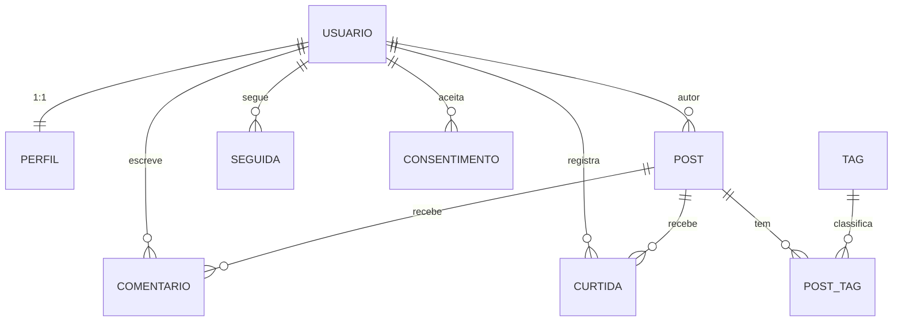
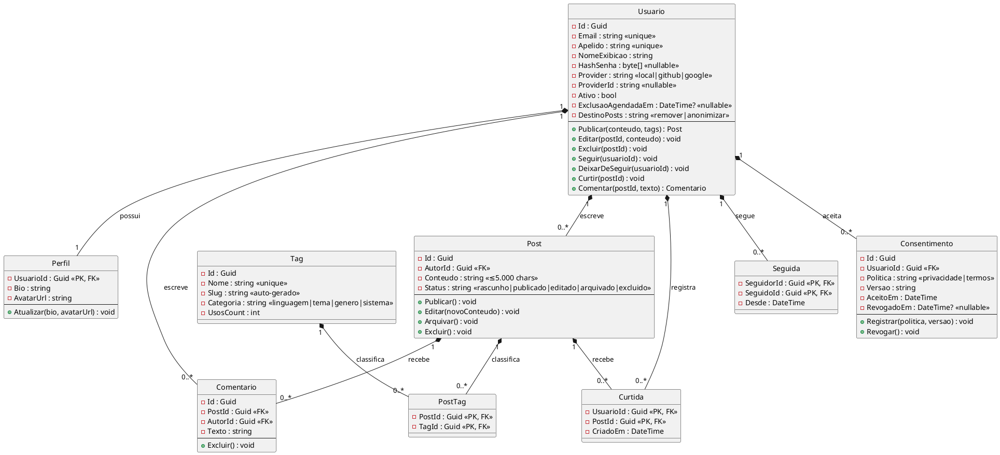

# Documento de Especificação — Agora

## 1. Capa e Sumário

### 1.1 Identificação

| Campo            | Dado                                                                                                                   |
| ---------------- | ---------------------------------------------------------------------------------------------------------------------- |
| **Instituição**  | UNA - Contagem                                                                                                         |
| **Disciplina**   | Garantia da Qualidade de Software                                                                                      |
| **Integrantes**  | Arthur Marques Diniz, Bernardo Luiz Monteverde Gonçalves, Luiz Filipe Pimenta Correa, Patrick Oliveira Rabelo de Brito |
| **Professor(a)** | Daniel Henrique Matos de Paiva                                                                                         |
| **Produto**      | Agora — rede social desktop de hobbies nerd (C# / .NET)                                                                |
| **Documento**    | Documento de Especificação (relatório técnico — Engenharia e Garantia de Software)                                     |

### 1.2 Sumário (índice estruturado)

| # | Seção | Conteúdo |
|---|---|---|
| 1 | Capa e Sumário | Identificação da instituição, disciplina, integrantes e índice |
| 2 | Visão Geral do Sistema | Escopo, objetivo do produto e público-alvo |
| 3 | Matriz de Requisitos | ID, Tipo, Descrição, Prioridade e Critério de Aceite |
| 4 | Modelagem de Dados e Arquitetura | Esquema do banco (tabelas e relacionamentos) e diagrama de classes |
| 5 | Estratégia de Versionamento e Qualidade | Repositório, branches, commits e critérios de merge |
| 6 | Plano de Garantia de Qualidade (QA) | Cenários de teste: Entrada, Passo a Passo e Resultado Esperado |

---

## 2. Visão Geral do Sistema

### 2.1 Escopo

**Agora** (do grego: praça pública) é um aplicativo **desktop nativo em C# (.NET 10 LTS)** de rede social focado em hobbies nerd — programadores, jogadores de RPG de mesa, leitores e gamers. Fase atual: **Fase 1 (MVP)** — app funcional para **20 betas internos**, com:

- Conta e perfil: cadastro/login/logout, recuperação de senha, perfil editável (nome, @apelido, avatar, bio);
- Conteúdo: posts com **Markdown**, **syntax highlighting** em blocos de código, 1–5 tags por post, feed **cronológico** (sem algoritmo) + feed por tags populares;
- Social: seguir/deixar de seguir, curtir (1 por usuário/post), comentar (autor exclui);
- Descoberta: busca por usuários (@apelido/nome), posts (palavra-chave) e tag;
- Privacidade/LGPD: exclusão de conta (anonimização ≤ 30 dias), exportação de dados, consentimento registrado (data/versão).

**Fora do escopo (nesta entrega):** mensagens diretas, upload de mídia, notificações in-app, contas privadas, moderação, OAuth (GitHub/Google), biblioteca de livros, repos GitHub, jogos jogados, mesas de RPG.

### 2.2 Objetivo do produto

Entregar uma rede social desktop **leve, rápida e cronológica** para o público nerd, valorizando conteúdo por interesse (tags de linguagem/tema/gênero/sistema) e **rendição fiel de código** — diferencial sobre redes genéricas e sobre apps móveis. Feeds não são escondidos por algoritmo; o conteúdo segue a ordem de publicação.

### 2.3 Público-alvo

| Anel | Nichos |
|---|---|
| **Primário** (foco do produto) | Jogadores, jogadores de RPG de mesa, leitores, programadores |
| **Secundário** (possível) | Musicistas, cinéfilos e hobbies similares |
| **Distante** (ainda plausível) | Outros hobbies (ex.: ciclismo) |

Personas guia (MVP): **Ana** (desenvolvedora — quer teclado, markdown e syntax highlighting), **Bruno** (mestre de RPG — quer feed cronológico previsível e tags de sistema/tema) e **Carla** (leitora — quer tags de gênero e busca por tag).

---

## 3. Matriz de Requisitos

> [!tip] Prioridade (MoSCoW)
> **Must** = Alta · **Should** = Média · **Could** = Baixa. Legenda do vault: Must = MVP · Should = Fase 2 · Could = Fase 3 · Won't = fora por ora.

### 3.1 Requisitos Funcionais (RF)

| ID | Tipo | Descrição | Prioridade | Critério de Aceite |
|---|---|---|---|---|
| RF-001 | RF | Cadastro com e-mail + senha, validando e-mail único | Must | Conta criada com e-mail válido e único; sessão iniciada. E-mail duplicado → erro amigável |
| RF-002 | RF | Autenticação (login/logout) e recuperação de senha por e-mail | Must | Login válido abre o feed; logout encerra; "esqueci senha" envia link por e-mail |
| RF-003 | RF | Perfil editável: nome de exibição, @apelido único, avatar, bio | Must | Alterações refletem imediatamente; @apelido duplicado → erro amigável |
| RF-004 | RF | Publicar posts com markdown (negrito, listas, código inline, code blocks) | Must | Markdown renderizado no feed; post aparece no feed dos seguidores |
| RF-005 | RF | Feed cronológico (seguidos + próprios), paginado | Must | Ordem cronológica real; paginação ao rolar |
| RF-006 | RF | Autor edita/exclui seus próprios posts | Must | Só o autor edita/exclui; não-autor recebe permissão negada |
| RF-007 | RF | Seguir e deixar de seguir qualquer usuário | Must | Seguir adiciona posts ao feed; deixar de seguir remove; auto-seguimento bloqueado |
| RF-008 | RF | Curtir posts (1 curtida por usuário/post) | Must | Conta 1×/usuário/post; curtir de novo desfaz (toggle) |
| RF-009 | RF | Comentar posts; autor do post/comentário pode excluir | Must | Comentário listado; exclusão restrita ao autor |
| RF-010 | RF | Busca por usuários (@apelido/nome) e posts (palavra-chave) | Must | Resultados separados (usuários/posts); navegação ao resultado |
| RF-016 | RF | Adicionar 1–5 tags de conteúdo ao post | Must | 1–5 tags aceitas; > 5 rejeitado (RN-09); nomes únicos (RN-08) |
| RF-017 | RF | Busca por tag, filtrando feed e resultados | Must | Posts com a tag retornados; sem resultados → mensagem clara |
| RF-018 | RF | Seção alternativa no feed: MVP por tags populares; F2 por tags seguidas | Must | Aba "Popular" ordena por tags mais usadas (feed `Popular` no MVP) |
| RF-022 | RF | Syntax highlighting detectando a linguagem pelo fence markdown | Must | Bloco ` ```csharp ` renderizado colorido ≤ 100 ms (P95) |
| RF-023 | RF | `categoria` obrigatória nas tags (linguagem/tema/genero/sistema) | Must | Tag sem categoria → rejeitada; categorias controlam filtros |
| RF-031 | RF | Splash/loading com logo (letter metálica + azul) ao iniciar | Must | Logo animada no início; ≤ 3 s; transição suave |
| RF-032 | RF | Excluir conta com anonimização ≤ 30 dias; escolha remover/anonimizar posts | Must | Exclusão agenda anonimização (≤ 30 d); destino dos posts conforme escolha |
| RF-033 | RF | Exportar dados pessoais em formato legível (LGPD) | Must | Arquivo legível entregue ≤ 15 dias; conteúdo completo |
| RF-034 | RF | Registro de consentimento (privacidade/termos) com data/versão; revogação | Must | Aceite no cadastro guarda data/hora + versão; revogação disponível |
| RF-011 | RF | Notificações in-app: nova curtida, comentário, seguidor | Should | Notificação criada para cada interação (Fase 2) |
| RF-012 | RF | Upload de mídia (imagem) em posts | Should | Imagem anexada e exibida no post (Fase 2) |
| RF-013 | RF | Mensagens diretas 1:1 | Should | Conversa 1:1 com histórico (Fase 2) |
| RF-019 | RF | Seguir tags (não só usuários) | Should | Simplificar em: tag seguida alimenta feed por interesse (Fase 2) |
| RF-020 | RF | Flair de perfil (badge visual: "C# Dev", "Mestre D&D") | Should | Badge exibido no perfil; nome/ícone/cor renderizam (Fase 2) |
| RF-021 | RF | Perfil expandido: stack tech, jogos favoritos, autores favoritos | Should | Campos opt-in preenchidos e exibidos (Fase 2) |
| RF-024 | RF | Cadastro/login via OAuth GitHub | Should | Conta criada/vincada e sessão iniciada; sem senha local (RN-10) (Fase 2) |
| RF-014 | RF | Contas privadas (aprovação de seguidores) | Could | Seguir perfil privado aguarda aprovação (Fase 3) |
| RF-015 | RF | Moderação: denúncia de conteúdo/usuário | Could | Denúncia registrada e encaminhada (Fase 3) |
| RF-025 | RF | Cadastro/login via OAuth Google | Could | Conta criada/vincada via Google (Fase 3) |
| RF-026 | RF | Vincular/desvincular conta de provedor externo (1 por conta) | Could | Provider vinculado/desvinculado (Fase 3) |
| RF-027 | RF | Biblioteca de livros (lidos, want-to-read, nota, resenha) | Could | Livro catalogado com status/nota/resenha (Fase 3) |
| RF-028 | RF | Integração com GitHub (repos, projetos, tech stack) | Could | Repositórios sincronizados ao perfil (Fase 3) |
| RF-029 | RF | Lista de jogos jogados (horas, review, plataforma) | Could | Jogo registrado com horas/review/plataforma (Fase 3) |
| RF-030 | RF | Mesas e campanhas de RPG (mesa, sessão, ficha, one-shot) | Could | Campanha/mesa/sessão/ficha gerenciáveis (Fase 3) |

### 3.2 Requisitos Não Funcionais (RNF)

> [!note] Critério
> O **Critério de Aceite** dos RNFs é a **Meta** mensurável definida no vault (padrão SMART). Atribuição MoSCoW: **Must** = RNFs críticos da Definição do MVP + RNF-07 (TLS, essencial para serviço online); **Should** = demais. Base normativa: ISO/IEC 25010:2011 (SQuaRE).

| ID | Tipo | Descrição | Prioridade | Critério de Aceite (Meta) |
|---|---|---|---|---|
| RNF-01 | RNF | Tempo de carregamento do feed (primeira página) | Must | Feed ≤ 2 s (P95) |
| RNF-02 | RNF | Inicialização do app até tela de login/feed | Must | ≤ 3 s em HDD comum ⚠️ |
| RNF-03 | RNF | Ações (curtir, comentar, seguir) com feedback visual | Must | Feedback ≤ 200 ms |
| RNF-04 | RNF | Navegação completa via teclado (100% sem mouse) | Should | Tab/Enter/setas cobrem 100% das ações |
| RNF-05 | RNF | Contraste WCAG AA (≥ 4.5:1); temas claro/escuro | Should | Ratio ≥ 4.5:1 em texto normal |
| RNF-06 | RNF | Hash adaptativo de senha (bcrypt/PBKDF2/Argon2) | Must | bcrypt cost ≥ 10 (OWASP); nunca texto puro |
| RNF-07 | RNF | Comunicação cliente-servidor sempre TLS 1.2+ | Must | Sem tráfego não criptografado |
| RNF-08 | RNF | Proteção contra força bruta no login | Must | ≤ 5 falhas → bloqueio ≥ 15 min (backoff) |
| RNF-09 | RNF | Conformidade LGPD (consentimento, exportação, exclusão) | Must | Solicitações atendiadas em ≤ 15 dias (art. 19) |
| RNF-10 | RNF | Windows 10+ primário; arquitetura não impede Linux/macOS | Must | Restrição arquitetural respeitada |
| RNF-11 | RNF | .NET LTS (10+) como runtime | Must | .NET 10 LTS; suporte até nov/2028 |
| RNF-12 | RNF | Código em camadas (UI, Aplicação, Domínio, Infra) | Must | 0 violações de dependência (teste de arquitetura no CI) |
| RNF-13 | RNF | Cobertura de testes ≥ 60% no núcleo de domínio ⚠️ | Must | ≥ 60% no domínio ⚠️ |
| RNF-14 | RNF | CI executando build + testes a cada push | Must | Build + testes ≤ 10 min ⚠️ |
| RNF-15 | RNF | Falha de rede não perde rascunho de post | Should | Autosave local preserva rascunho |
| RNF-16 | RNF | Logs estruturados sem dados sensíveis | Should | Logs sem PII (LGPD) |
| RNF-17 | RNF | Syntax highlighting completa em blocos de código | Must | ≤ 100 ms (P95) para blocos até 50 linhas |
| RNF-18 | RNF | Animações/transições de tela (splash, loading, transições) | Must | 60 fps; splash ≤ 3 s; transições ≤ 300 ms |
| RNF-19 | RNF | Múltiplos ambientes (dev/staging/prod) isolados | Must | 3 ambientes (ADR-004) |
| RNF-20 | RNF | Deploy automatizado com pipeline (CI/CD) | Must | Staging automático; prod via aprovação |
| RNF-21 | RNF | Backup e restauração do banco de produção | Must | Backup diário; restore testado |
| RNF-22 | RNF | Observabilidade: logs, métricas, health checks, alertas | Must | Logs (Serilog) + health checks no MVP; métricas OTLP; dashboards na Fase 2 |
| RNF-23 | RNF | Empacotamento MSIX (sideload e possível Store) | Must | Installer MSIX + package identity gerado |
| RNF-24 | RNF | SLA de disponibilidade da produção | Must | ≥ 99,5% mensal; exclui janelas de manutenção programadas |
| RNF-25 | RNF | Throughput do servidor | Must | ≥ 50 req/s sustentados (leitura); sem degradar RNF-01/03 |
| RNF-26 | RNF | Alinhamento a princípios GDPR (minimização, retenção, notificação) | Must | Consentimento registrado; retenção dados/backups ≤ 30 d; notificação ≤ 72 h ⚠️ |

---

## 4. Modelagem de Dados e Arquitetura

### 4.1 Arquitetura do sistema

Padrão **cliente-servidor** (ADR-002) com **4 camadas** no código: **UI → Aplicação → Domínio ← Infra** (dependência aponta para dentro — 0 violações, RNF-12). Componentes:

| Camada | Responsabilidade |
|---|---|
| UI | Avalonia UI + MVVM (CommunityToolkit.Mvvm) |
| Aplicação | Casos de uso, validação de fluxos |
| Domínio | Entidades e regras de negócio (RN) |
| Infra | EF Core 10 (SQLite no client; Npgsql/PostgreSQL no servidor) |

### 4.2 Esquema do banco de dados — entidades (Fase 1 — MVP)

> Gestão: **PostgreSQL via Npgsql** no servidor; **SQLite** no client (configs, rascunho, cache). Entidades Fase 2/3 (NOTIFICACAO, SEGUE_TAG, FLAIR, LIVRO, JOGO, CAMPANHA, MESA, SESSAO, FICHA, REPOSITORIO) existem no modelo mas entram nas respectivas fases.

| Tabela | Atributos principais | Chaves | Fase |
|---|---|---|---|
| USUARIO | email (UK), apelido (UK), nome_exibicao, hash_senha, provider, provider_id, ativo, exclusao_agendada_em, destino_posts, criado_em | PK `id` (uuid) | F1 |
| PERFIL | bio, avatar_url | PK/FK `usuario_id` (1:1) | F1 |
| POST | conteudo (≤ 5.000), status (rascunho/publicado/editado/arquivado/excluido), publicado_em, editado_em | PK `id`; FK `autor_id` | F1 |
| COMENTARIO | texto, criado_em | PK `id`; FK `post_id`, `autor_id` | F1 |
| CURTIDA | criado_em | PK composta (`usuario_id`, `post_id`) | F1 |
| SEGUIDA | desde | PK composta (`seguidor_id`, `seguido_id`) | F1 |
| CONSENTIMENTO | politica (privacidade/termos), versao, aceito_em, revogado_em | PK `id`; FK `usuario_id` | F1 |
| TAG | nome (UK), slug (UK), categoria, usos_count | PK `id` | F1 |
| POST_TAG | — | PK composta (`post_id`, `tag_id`) | F1 |

**Relacionamentos principais:**

| Origem | Cardinalidade | Destino | Semântica |
|---|---|---|---|
| USUARIO | 1:1 | PERFIL | possui perfil |
| USUARIO | 1:N | POST | é autor |
| USUARIO | 1:N | COMENTARIO | escreve |
| USUARIO | 1:N | CURTIDA | registra |
| POST | 1:N | COMENTARIO / CURTIDA | recebe |
| USUARIO | 1:N | SEGUIDA (seguidor) | segue |
| USUARIO | 1:N | CONSENTIMENTO | aceita |
| POST | N:N | TAG | via POST_TAG (≤ 5 tags) |
| USUARIO | N:N | USUARIO (self) | via SEGUIDA |



### 4.3 Diagrama de classes (núcleo — Fase 1)

> Classe por modulo do Domínio, com atributos e métodos principais. Diagrama UML nativo (PlantUML) abaixo; descrição tabular para portabilidade ao Word.

| Classe | Atributos principais | Métodos principais | Relacionamentos |
|---|---|---|---|
| **Usuario** | Id, Email (UK), Apelido (UK), NomeExibicao, HashSenha, Provider, ProviderId, Ativo, ExclusaoAgendadaEm, DestinoPosts, CriadoEm | Publicar, Editar, Excluir, Seguir, DeixarDeSeguir, Curtir, Comentar | 1—1 Perfil; 1—* Post, Comentario, Curtida, Seguida, Consentimento |
| **Perfil** | UsuarioId (PK/FK), Bio, AvatarUrl | Atualizar | 1—1 Usuario |
| **Post** | Id, AutorId, Conteudo, Status, PublicadoEm, EditadoEm | Publicar, Editar, Arquivar, Excluir | *—1 Usuario (autor); 1—* Comentario, Curtida, PostTag |
| **Comentario** | Id, PostId, AutorId, Texto, CriadoEm | Excluir | *—1 Post; *—1 Usuario |
| **Curtida** | UsuarioId (PK), PostId (PK), CriadoEm | Toggle | *—1 Usuario; *—1 Post |
| **Seguida** | SeguidorId (PK), SeguidoId (PK), Desde | — | *—1 Usuario (seguidor/seguido) |
| **Consentimento** | Id, UsuarioId, Politica, Versao, AceitoEm, RevogadoEm | Registrar, Revogar | *—1 Usuario |
| **Tag** | Id, Nome (UK), Slug (UK), Categoria, UsosCount | — | 1—* PostTag |
| **PostTag** | PostId (PK), TagId (PK) | — | *—1 Post; *—1 Tag |



---

## 5. Estratégia de Versionamento e Qualidade

### 5.1 Repositório remoto

| Item | Definição |
|---|---|
| Controle de versão | Git / GitHub |
| Repositório remoto | `https://github.com/Agora-s-Space/Social.Agora.git` (configurado) |
| Conteúdo do repositório | `Agora.Docs/` (documentação) + código da Fase 1 (a migrar) |

### 5.2 Estratégia de branches

Modelo: **GitHub Flow simplificado** (`main` + branches curtas; sem `develop`).

| Item | Decisão |
|---|---|
| Branch principal | `main` (protegida — sem push direto) |
| Branches de trabalho | Curtas e descritivas: `feat/...`, `docs/...`, `chore/...`, `fix/...` |
| Integração | PR aberto para `main` |

### 5.3 Convenções de commit

**Conventional Commits** — prefixo de tipo: `feat:`, `fix:`, `docs:`, `chore:`, `refactor:`, `test:`.

Exemplos:
- `feat: cadastro de usuário com e-mail único`
- `fix: ajusta ordem do feed cronológico`
- `docs: atualiza diagrama ER da Fase 1`

### 5.4 Critérios mínimos para merge

| Critério | Condição |
|---|---|
| Aprovação | PR com **≥ 1 aprovação** (revisão obrigatória — CODEOWNERS cobre `Agora.Docs/`) |
| CI verde | Build + testes passando (RNF-14) |
| Conflitos | Sem conflitos de merge |
| Padrão de commit | Commit padronizado (Conventional Commits) |

### 5.5 Qualidade (relação com RNFs)

| Garantia | RNF | Como é verificada |
|---|---|---|
| Build + testes a cada push | RNF-14 | CI |
| Cobertura ≥ 60% domínio | RNF-13 ⚠️ | Relatório de cobertura no CI |
| 0 violações de dependência entre camadas | RNF-12 | Teste de arquitetura (backlog B-49) |
| Throughput ≥ 50 req/s | RNF-25 | Teste de carga no CI (backlog B-48, NBomber ⚠️) |

---

## 6. Plano de Garantia de Qualidade (QA)

### 6.1 Cenários de teste (Entrada · Passo a Passo · Resultado Esperado)

> [!note]
> Cenários definidos a partir dos RFs MVP e dos critérios de aceitação da primeira entrega.

#### CTA-01 — Cadastro, login, logout e recuperação de senha

| Campo | Conteúdo |
|---|---|
| **Entrada** | E-mail `maria@exemplo.com` (não cadastrado), senha forte, @apelido `maria`; depois e-mail já cadastrado |
| **Passo a Passo** | 1. Abrir o app · 2. Acessar tela de cadastro · 3. Preencher e-mail/senha/@apelido e confirmar · 4. Realizar logout · 5. Tentar login com credenciais corretas · 6. Testar cadastro com e-mail duplicado · 7. Clicar em "Esqueci minha senha" |
| **Resultado Esperado** | Conta criada e sessão iniciada; logout encerra; login válido abre o feed; e-mail duplicado exibe erro amigável; link de recuperação enviado ao e-mail. RNF-08: 5 falhas consecutivas bloqueiam login ≥ 15 min |

#### CTA-02 — Publicar post com Markdown e syntax highlighting

| Campo | Conteúdo |
|---|---|
| **Entrada** | Texto com negrito, lista, código inline e bloco ` ```csharp `; 3 tags (`csharp`, `dnd`, `fantasia`) |
| **Passo a Passo** | 1. Logado, abrir o compositor · 2. Digitar o texto com markdown · 3. Adicionar 1–5 tags com categoria · 4. Publicar · 5. Visualizar no feed |
| **Resultado Esperado** | Post renderizado com formatação; bloco de código colorido (RF-022) ≤ 100 ms; tags aplicadas; post visível para seguidores na ordem cronológica |

#### CTA-03 — Feed cronológico e interações (curtir/comentar)

| Campo | Conteúdo |
|---|---|
| **Entrada** | Dois usuários (A e B); A segue B; B publica 3 posts em sequência |
| **Passo a Passo** | 1. A acessa o feed · 2. Verificar ordem dos posts de B · 3. A curte um post · 4. A curta novamente o mesmo post · 5. A comenta um post de B · 6. B tenta excluir comentário de A |
| **Resultado Esperado** | Feed em ordem cronológica (RN-07); curtir conta 1× e desfaz no toggle (RN-02); comentário criado; só o autor do comentário (A) pode excluí-lo (RN-01) |

#### CTA-04 — Busca por usuário, palavra-chave e tag

| Campo | Conteúdo |
|---|---|
| **Entrada** | Termo `csharp`; tag `dnd`; usuário `@maria` |
| **Passo a Passo** | 1. Digitar `csharp` na busca · 2. Verificar resultado separado (usuários/posts/tags) · 3. Clicar na tag `dnd` · 4. Buscar termo inexistente |
| **Resultado Esperado** | Resultados de usuários, posts por palavra-chave e posts por tag (RF-010/017); tag filtra corretamente; termo inexistente exibe "Nenhum resultado encontrado" |

#### CTA-05 — Exclusão de conta e exportação de dados (LGPD)

| Campo | Conteúdo |
|---|---|
| **Entrada** | Usuário com posts, escolhendo "remover" os posts; solicitação de exportação |
| **Passo a Passo** | 1. Abrir "Conta e dados" · 2. Solicitar exportação · 3. Confirmar recebimento do arquivo · 4. Iniciar exclusão da conta · 5. Escolher destino dos posts (remover) · 6. Confirmar exclusão |
| **Resultado Esperado** | Arquivo legível entregue ≤ 15 dias (RF-033/RNF-09); exclusão agenda anonimização ≤ 30 dias (RF-032); conta inativa ao final |

#### CTA-06 — Consentimento e revogação

| Campo | Conteúdo |
|---|---|
| **Entrada** | Novo cadastro aceitando Política de Privacidade e Termos; posterior revogação |
| **Passo a Passo** | 1. Realizar o cadastro aceitando as políticas · 2. Consultar registro do consentimento (data/hora + versão) · 3. Revogar o consentimento |
| **Resultado Esperado** | Aceite registrado no CONSENTIMENTO com data/versão (RF-034); revogação registrada com `revogado_em` |

#### CTA-07 — Desempenho (certificar RNF-01/RNF-17/RNF-25)

| Campo | Conteúdo |
|---|---|
| **Entrada** | Dataset simulado com volume realista; bloco de código de 50 linhas |
| **Passo a Passo** | 1. Medir tempo de carregamento da primeira página do feed · 2. Medir renderização de um bloco de código 50 linhas · 3. Rodar teste de carga no CI |
| **Resultado Esperado** | Feed ≤ 2 s (P95); highlighting ≤ 100 ms; throughput ≥ 50 req/s sustentados sem degradar os demais (metas RNF-01/17/25) |

---

## Referências

- [[Home]] · [[01 Requisitos/Visão do Produto|Visão do Produto]]
- [[01 Requisitos/Requisitos Funcionais|Requisitos Funcionais]] · [[01 Requisitos/Requisitos Não Funcionais|Requisitos Não Funcionais]] · [[01 Requisitos/Regras de Negócio|Regras de Negócio]] · [[01 Requisitos/Casos de Uso|Casos de Uso]]
- [[02 Modelagem/Modelo de Dados (ER)|Modelo de Dados (ER)]] · [[02 Modelagem/Modelo de Domínio|Modelo de Domínio]] · [[02 Modelagem/Arquitetura do Sistema|Arquitetura]]
- [[04 Gestão/Definição do MVP|Definição do MVP]] · [[04 Gestão/Operações e Deploy|Operações e Deploy]] · [[04 Gestão/Backlog do Produto|Backlog do Produto]] · [[04 Gestão/Custos e Licenças|Custos e Licenças]]
- [[04 Gestão/Verificação da Primeira Entrega|Verificação da Primeira Entrega]]