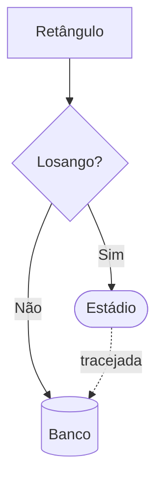
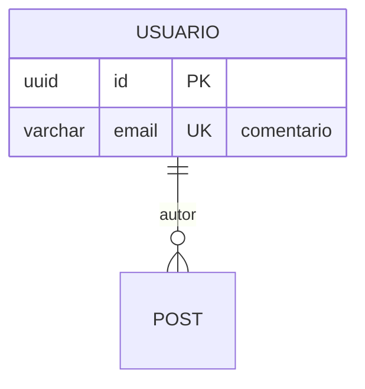
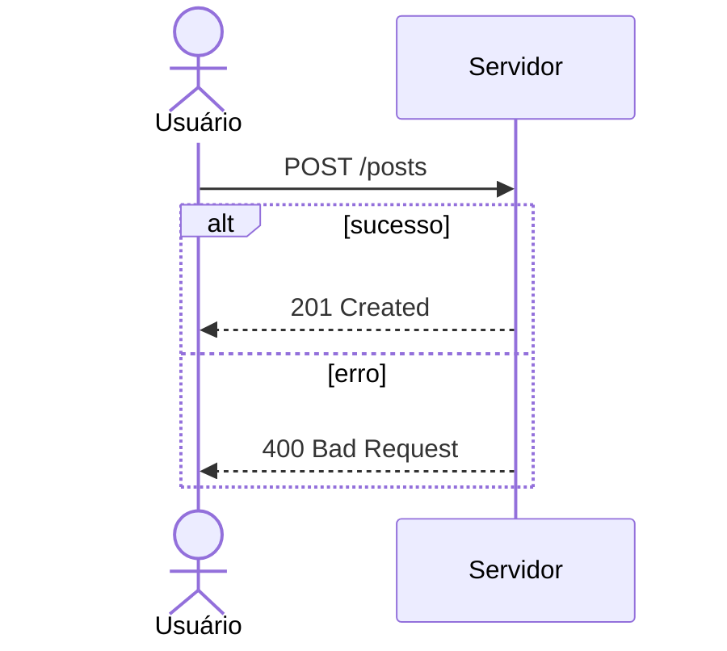

# Cheatsheet Mermaid (Obsidian)

> [!info] Uso no projeto
> Obsidian renderiza Mermaid nativamente. Usado para: **sequence**, **flowchart**, **ER**, **gantt** e **mindmap**. PlantUML (plugin) é usado para classes, componentes, estados e use cases.

## flowchart — decisões e processos
````markdown

````

## erDiagram — banco de dados
````markdown

````

## sequenceDiagram — fluxos entre componentes
````markdown

````

## gantt / mindmap — gestão
````markdown
```mermaid
gantt
    title Plano
    dateFormat YYYY-MM-DD
    Tarefa :done, 2026-08-24, 2026-09-06

mindmap
  root((Tema))
    Ramo A
      Folha
```
````

## Armadilhas comuns
1. Fences aninhadas: para documentar código Mermaid dentro de um bloco, use ```` ```` ```` (4 crases) por fora
2. `end` minúsculo em flowchart quebra o parser → use `fim` ou maiúsculas em labels
3. Aspas dentro de rótulos precisam escapar: `["texto com \"aspas\""]` ou evitar
4. `×` e acentos funcionam em labels; `<br/>` quebra linha
5. Nós com parênteses/colchetes no texto exigem aspas: `A["Feed (v2)"]`

## Referência oficial
https://mermaid.js.org/syntax/flowchart.html
