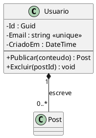
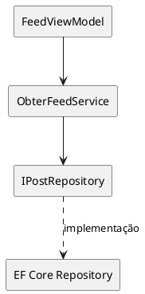
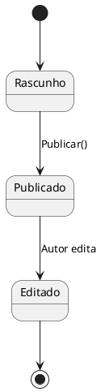
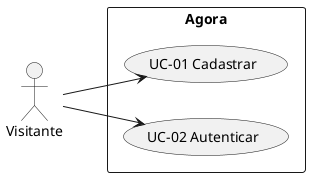

# Cheatsheet PlantUML (Obsidian)

> [!info] Uso no projeto
> PlantUML é plugin do Obsidian. Usado para: **classes**, **componentes**, **estados** e **use cases**. Mermaid continua para sequence, flowchart, ER, gantt e mindmap.

## class — modelo de domínio
````markdown

````

> [!tip] Visibilidade
> `-` privado, `+` público, `#` protegido, `~` pacote. Use `--` para separar atributos de métodos.

## component — arquitetura
````markdown

````

> [!tip] Notações
> `-->` dependência, `..>` dependência tracejada, `database` para bancos, `package` para agrupar camadas.

## state — máquinas de estado
````markdown

````

> [!tip] Sintaxe
> `[*]` estado inicial/final. `-->` transição. `: rótulo` na transição. PlantUML suporta estados compostos e entry/exit points.

## use case — diagrama de casos de uso
````markdown

````

> [!tip] Direção
> `left to right direction` para layout horizontal. `top to bottom` para vertical (padrão). Use `include`/`extend` para relacionamentos entre UCs.

## Armadilhas comuns
1. Sempre begin/end com `@startuml` / `@enduml` — sem eles o plugin não renderiza
2. `skinparam` para estilizar: `classAttributeIconSize 0` oculta ícones de visibilidade
3. `hide circle` remove o círculo de composição da classe
4. Labels com espaço: use `"texto com espaço"` ou `~` para neutralizar
5. `note left of`, `note right of`, `note bottom of` para anotações no diagrama
6. `left to right direction` inverte eixo do use case/component diagram

## Referência oficial
https://plantuml.com/
