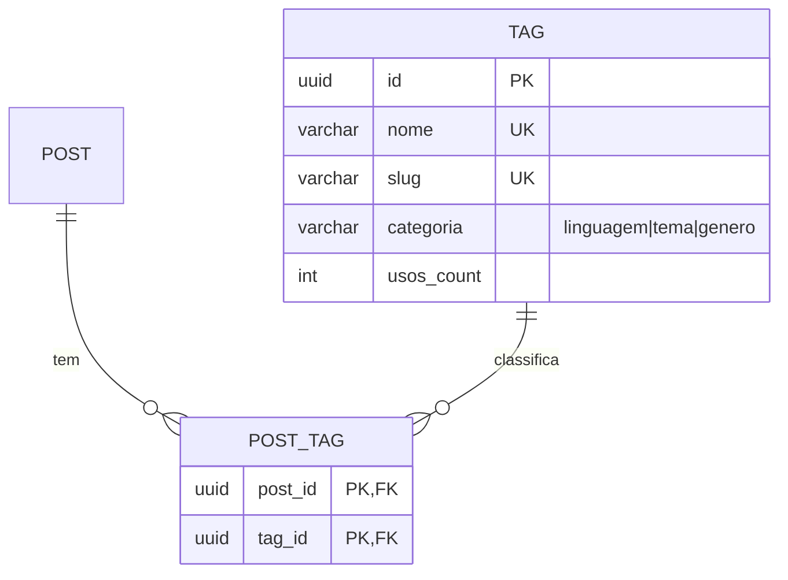
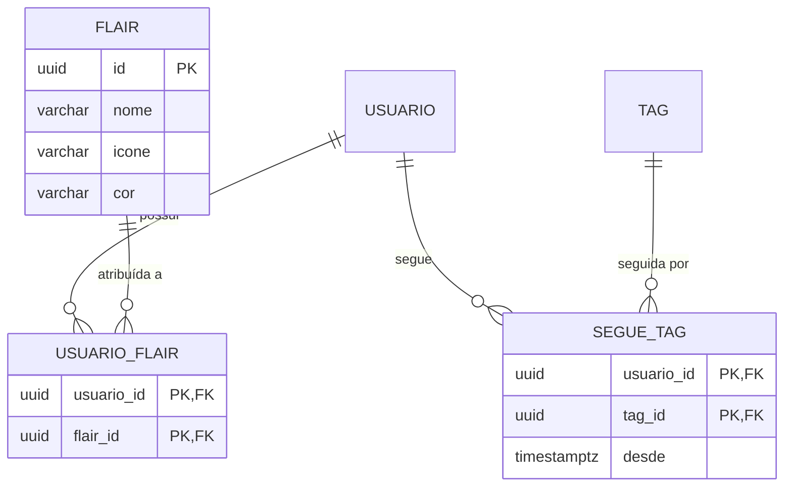
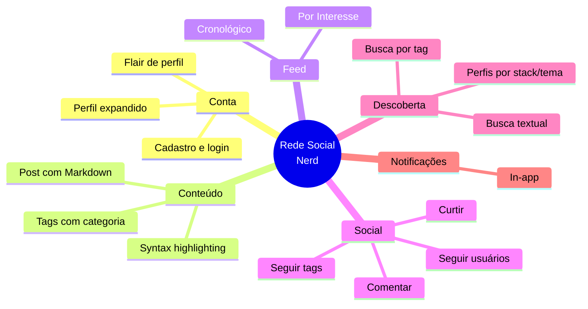

# Plano — Agora: Rede Social de Nicho (Devs/Gamers/Leitores)

> [!abstract] Objetivo deste documento
> Mapear o impacto de direcionar o produto **Agora** para **programadores, jogadores de RPG, leitores e gamers**, com funcionalidades profundas que tornem a plataforma relevante para esse público. **Este plano é o conceito base do produto.**

---

## 1. Resumo executivo

A ideia é posicionar **Agora** como uma **plataforma para nerd culture**, com funcionalidades profundas que atendam diretamente o público-alvo: syntax highlighting, tags de linguagem/tema, flair de perfil, feed por interesse.

**Impacto geral:** evolução significativa, mas viável dentro do escopo atual (Fase 0). Não é um revamp — é uma camada de profundidade por cima da estrutura genérica.

---

## 2. Público-alvo proposto

### Persona primária — Devs
- Compartilham código, snippets, projetos
- Valorizam syntax highlighting e markdown
- Querem seguir devs de-stack similar
- **Dor:** redes sociais genéricas não renderizam código

### Persona secundária — Gamers/RPG
- Compartilham builds, campanhas, one-shots
- Valorizam flair de classe/personagem
- Querem descobrir jogadores de mesma mesa
- **Dor:** Discord é bom para chat, mas ruim para feed público

### Persona terciária — Leitores/Colecionadores
- Compartilham resenhas, listas, recomendações
- Valorizam tags de gênero/autor
- Querem descobrir pessoas com gosto similar
- **Dor:** Goodreads é limitado e sem feed social

---

## 3. Funcionalidades propostas por fase

### 3.1 MVP — Fase 1 (Must)

| Funcionalidade | Descrição | RF (final) | Impacto no ER |
|---|---|---|---|
| **Markdown em posts** | Suporte a formatação básica (negrito, listas, código inline, blocos de código) | [[01 Requisitos/Requisitos Funcionais#RF-004\|RF-004]] | Não |
| **Syntax highlighting** | Renderização colorida de blocos de código por linguagem (fence markdown) | [[01 Requisitos/Requisitos Funcionais#RF-022\|RF-022]] | Não |
| **Tags de conteúdo** | 1–5 tags por post, com `categoria` obrigatória | [[01 Requisitos/Requisitos Funcionais#RF-016\|RF-016]], [[01 Requisitos/Requisitos Funcionais#RF-023\|RF-023]] | Sim — TAG, POST_TAG |
| **Busca por tag** | Filtrar feed e resultados por tag | [[01 Requisitos/Requisitos Funcionais#RF-017\|RF-017]] | Índice novo |
| **Feed por tags populares** | Seção alternativa ao cronológico, ordenada por tags mais usadas | [[01 Requisitos/Requisitos Funcionais#RF-018\|RF-018]] | Não (query diferente) |

> [!note] IDs sincronizados
> Os números de RF desta seção conferem com [[01 Requisitos/Requisitos Funcionais]] (revisão de 2026-08-28). "Markdown" já era RF-004; tags/busca/feed populares viraram RF-016/017/018; highlighting e categoria são RF-022/023. Markdown e highlighting são **RFs Must antes já adotados** na modelagem original.

**Entidades novas (Fase 1):**



**RN novas:**
- RN-08: Tags são de uso livre; nomes únicos, slug auto-gerado
- RN-09: Máximo de 5 tags por post

### 3.2 Fase 2 (Should)

| Funcionalidade | Descrição | RF (final) | Impacto no ER |
|---|---|---|---|
| **Feed por interesse** | Seção alternativa ao cronológico, por tags que o usuário segue (requer seguir tags) | [[01 Requisitos/Requisitos Funcionais#RF-018\|RF-018]] (Fase 2) | Não (query diferente) |
| **Seguir tags** | Usuário segue tags, não só usuários | [[01 Requisitos/Requisitos Funcionais#RF-019\|RF-019]] | Sim — SEGUE_TAG |
| **Flair de perfil** | Badge visual (ex: "C# Dev", "Mestre D&D", "Leitor") | [[01 Requisitos/Requisitos Funcionais#RF-020\|RF-020]] | Sim — FLAIR, USUARIO_FLAIR |
| **Perfil expandido** | Campos: stack tech, jogos favoritos, autores favoritos | [[01 Requisitos/Requisitos Funcionais#RF-021\|RF-021]] | Sim — extensão do PERFIL |

**Entidades novas (Fase 2):**



> [!note] Modelagem futura
> `SEGUE_TAG`, `FLAIR` e `USUARIO_FLAIR` (assim como `LIVRO`, `JOGO`, `REPOSITORIO`, `CAMPANHA`, `MESA`, `SESSAO`, `FICHA`) ainda **não estão** no [[02 Modelagem/Modelo de Dados (ER)|ER]]/[[02 Modelagem/Modelo de Domínio|Domínio]] — devem ser modelados quando cada fase iniciar (ver [[VAULT/Checklist - Correções do Plano]]).

**Feed híbrido:**
```
Feed Cronológico (original) | Feed por Interesse (novo)
         ↓                            ↓
   Posts dos seguidos         Posts das tags que sigo
   + próprios                 + posts populares nessas tags
```

### 3.3 Fase 3 (Could)

| Funcionalidade | Descrição | RF (final) | Impacto no ER |
|---|---|---|---|
| **Biblioteca de livros** | Lista lidos, want-to-read, notas, resenha no perfil | [[01 Requisitos/Requisitos Funcionais#RF-027\|RF-027]] | Sim — LIVRO, USUARIO_LIVRO |
| **Integração GitHub** | Repositórios, projetos recentes, tech stack no perfil | [[01 Requisitos/Requisitos Funcionais#RF-028\|RF-028]] | Sim — REPOSITORIO |
| **Jogos jogados** | Lista com horas jogadas, review, plataforma | [[01 Requisitos/Requisitos Funcionais#RF-029\|RF-029]] | Sim — JOGO |
| **Mesas e campanhas RPG** | Espaço dedicado: mesa, sessão, ficha, sistema, one-shots | [[01 Requisitos/Requisitos Funcionais#RF-030\|RF-030]] | Sim — CAMPANHA, MESA, SESSAO, FICHA |
| **OAuth GitHub / Google** | Login/cadastro via provedor externo + vínculo de conta | [[01 Requisitos/Requisitos Funcionais#RF-024\|RF-024]] (F2) · [[01 Requisitos/Requisitos Funcionais#RF-025\|RF-025]], [[01 Requisitos/Requisitos Funcionais#RF-026\|RF-026]] (F3) | USUARIO.provider |

> [!note] Avaliadas e não adotadas
> **Séries de posts** e **Coleções** foram avaliadas e **não entraram** no backlog de RFs — funcionalidades consideradas e descartadas (ver [[VAULT/Checklist - Correções do Plano]]).

---

## 4. Impacto na modelagem existente

### 4.1 Arquivo: Modelo de Dados (ER)

| Mudança | Tipo | Descrição |
|---|---|---|
| Tabela `TAG` | Nova | Nome, slug, categoria, contagem de usos |
| Tabela `POST_TAG` | Nova | Relação N:N post-tag (PK composta) |
| Tabela `SEGUE_TAG` | Nova (Fase 2) | Usuário segue tags |
| Tabela `FLAIR` | Nova (Fase 2) | Badges visuais de perfil |
| Tabela `USUARIO_FLAIR` | Nova (Fase 2) | Relação N:N usuário-flair |
| Extensão `PERFIL` | Alteração | Novos campos: stack, jogos, autores |

### 4.2 Arquivo: Requisitos Funcionais

| RF | Mudança |
|---|---|
| RF-004 (Publicar post) | Adicionar suporte a markdown |
| RF-005 (Feed) | Adicionar seção "por interesse" |
| RF-010 (Busca) | Adicionar filtro por tag |

### 4.3 Arquivo: Regras de Negócio

| RN | Nova regra |
|---|---|
| RN-08 | Tags são de uso livre; nomes únicos; slug auto-gerado |
| RN-09 | Máximo 5 tags por post |

### 4.4 Arquivo: Casos de Uso

| UC | Mudança |
|---|---|
| UC-04 (Publicar) | Adicionar passo de seleção de tags |
| UC-05 (Feed) | Adicionar aba "Por Interesse" |
| UC-08 (Buscar) | Adicionar filtro por tag |

---

## 5. Impacto no backlog

| ID | Item | Origem | Esforço | Prioridade | Fase |
|---|---|---|---|---|---|
| B-24 | Syntax highlighting em code blocks | RF-022 | M | Must | 1 |
| B-25 | Tags com categoria | RF-023 | M | Must | 1 |
| B-18 | Adicionar 1–5 tags ao post | RF-016 | L | Must | 1 |
| B-19 | Busca por tag | RF-017 | M | Must | 1 |
| B-20 | Feed por tags populares | RF-018 | M | Must | 1 |
| B-21 | Seguir tags (feed personalizado) | RF-019 | M | Should | 2 |
| B-22 | Flair de perfil (badge visual) | RF-020 | S | Should | 2 |
| B-23 | Perfil expandido (stack, jogos, autores) | RF-021 | M | Should | 2 |
| B-26 | OAuth GitHub | RF-024 | L | Should | 2 |

> [!note] Consistência
> IDs conferem com [[04 Gestão/Backlog do Produto]] (revisão 2026-08-28). Markdown está sob **B-03** (RF-004). Séries/Coleções não geraram B-items. LGPD entrou como B-43/B-44/B-45.

---

## 6. Decisões de produto — resolvidas (D-1..D-5)

> [!note] Fechadas em 2026-08-28
> Todas as decisões D-1..D-5 foram tomadas e **refletidas** em [[01 Requisitos/Requisitos Funcionais|RFs]] e [[04 Gestão/Backlog do Produto|Backlog]]. Não há mais decisões abertas deste bloco.

| # | Pergunta | Decisão final | Onde consta |
|---|---|---|---|
| D-1 | Tags controladas ou livres? | Livres; `categoria` obrigatória + sugestões por categoria | RF-023, RN-08 |
| D-2 | Feed por interesse substitui ou complementa? | Complementa — aba separada (respecta RN-07) | RF-018, UC-05 |
| D-3 | Markdown completo ou subset? | Subset no MVP (negrito, listas, código); full depois | RF-004 |
| D-4 | Tags com hierarquia? | Flat com campo `categoria` | RF-023, `TAG.categoria` |
| D-5 | Perfil expandido obrigatório ou opt-in? | Opt-in, sem forçar | RF-021 (Fase 2) |

---

## 7. Riscos adicionais

| Risco | Impacto | Prob. | Mitigação |
|---|---|---|---|
| Tags viram spam/lixo | Alto | Média | Rate limit + moderação futura (RF-015) |
| Feed por interesse fica lento | Alto | Média | Cache + índices em TAG/POST_TAG; medir RNF-01 |
| Escopo cresce demais no MVP | Alto | Alta | Tags e markdown no MVP; resto na Fase 2 |
| Público de nicho é pequeno demais | Médio | Baixa | Validação com betas antes de investir pesado |
| LGPD: exclusão/anonimização mal implementada | Alto | Baixa | RF-032/RF-033 no MVP + testes (RN-04, RNF-09) |

---

## 8. Próximos passos — status

- [x] **Decisões D-1..D-5** — fechadas e refletidas nos RFs (seção 6)
- [x] **RFs/RNFs atualizados** — tags, busca por tag, feed popular, highlighting, categoria, splash; LGPD entrou como RF-032/033 (16 → 18 RFs de MVP)
- [x] **Backlog sincronizado** — IDs finais (B-18..B-26) + itens LGPD (B-43/B-44) + e-mail transacional (B-45)
- [x] **Stack de persistência fixada** — SQLite no client (configs/rascunho/cache) + **Npgsql/PostgreSQL** no servidor ([[03 Decisões/ADR-007 Banco do Servidor (Npgsql)|ADR-007]])
- [x] **Notas de decisão de produto** — avatar (URL no MVP), busca (FTS Postgres), e-mail, criação de tags, syntax highlighting (AvaloniaEdit + Markdig)
- [x] **Visão do Produto/Personas** — público-alvo de nicho consolidado: primário (jogadores, RPG de mesa, leitores, programadores), secundário (música, cinema), distante (ciclistas e afins)
- [x] **ADR-006 decidida** — observabilidade **adiada, fora do MVP** (Prometheus + Grafana na Fase 2, ainda a planejar → [[04 Gestão/Backlog do Produto#B-46|B-46]])
- [ ] **Modelar entidades Fase 2/3** no ER/Domínio (SEGUE_TAG, FLAIR, LIVRO, JOGO, CAMPANHA, …)

---

## 9. Mapa mental do produto evoluído



---

Links: [[Home]] · [[01 Requisitos/Visão do Produto]] · [[04 Gestão/Backlog do Produto]] · [[04 Gestão/Roadmap]]
