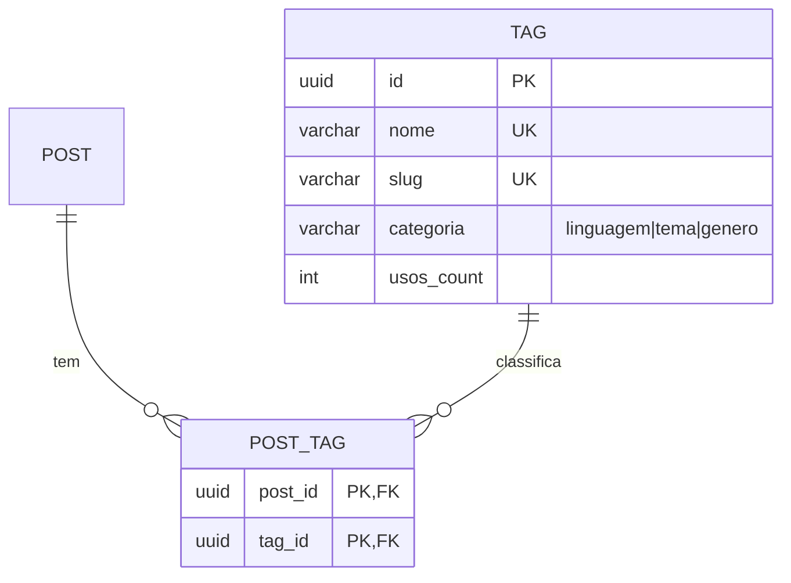
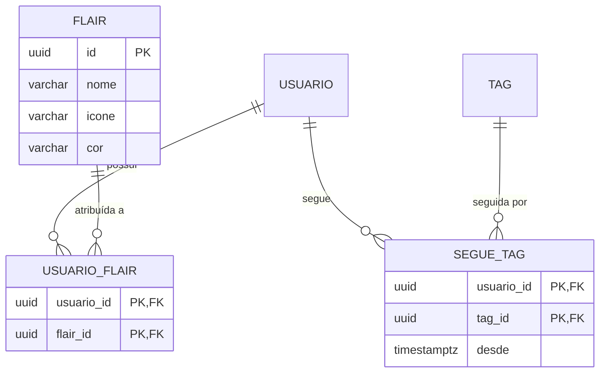
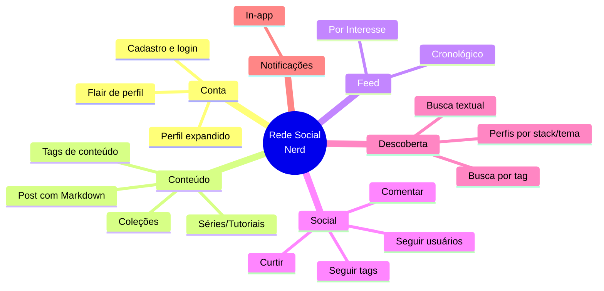

# Plano — Agora: Rede Social de Nicho (Devs/Gamers/Leitores)

> [!abstract] Objetivo deste documento
> Mapear o impacto de direcionar o produto **Agora** para **programadores, jogadores de RPG, leitores e gamers**, com funcionalidades profundas que tornem a plataforma relevante para esse público. **Este plano é o conceito base do produto.**

---

## 1. Resumo executivo

A ideia é posicionar **Agora** como uma **plataforma para nerd culture**, com funcionalidades profundas que atendam diretamente o público-alvo: syntax highlighting, tags de linguagem/tema, flair de perfil, feed por interesse.

**Impacto geral:** evolução significativa, mas viável dentro do escopo atual (Fase 0). Não é um revamp — é uma camada de profundidade por cima da estrutura genérica.

---

## 2. Público-alvo proposto

### Persona primária — Devs
- Compartilham código, snippets, projetos
- Valorizam syntax highlighting e markdown
- Querem seguir devs de-stack similar
- **Dor:** redes sociais genéricas não renderizam código

### Persona secundária — Gamers/RPG
- Compartilham builds, campanhas, one-shots
- Valorizam flair de classe/personagem
- Querem descobrir jogadores de mesma mesa
- **Dor:** Discord é bom para chat, mas ruim para feed público

### Persona terciária — Leitores/Colecionadores
- Compartilham resenhas, listas, recomendações
- Valorizam tags de gênero/autor
- Querem descobrir pessoas com gosto similar
- **Dor:** Goodreads é limitado e sem feed social

---

## 3. Funcionalidades propostas por fase

### 3.1 MVP — Fase 1 (Must)

| Funcionalidade | Descrição | Novo RF? | Impacto no ER |
|---|---|---|---|
| **Markdown em posts** | Suporte a formatação básica (negrito, listas, código inline, blocos de código) | Sim — RF-016 | Não |
| **Tags de conteúdo** | Usuário adiciona 1-5 tags ao post (ex: `csharp`, `dnd`, `fantasia`) | Sim — RF-017 | Sim — 2 tabelas |
| **Busca por tag** | Filtrar feed e resultados por tag | Sim — RF-018 | Índice novo |

**Entidades novas (Fase 1):**



**RN novas:**
- RN-08: Tags são de uso livre; nomes únicos, slug auto-gerado
- RN-09: Máximo de 5 tags por post

### 3.2 Fase 2 (Should)

| Funcionalidade | Descrição | Novo RF? | Impacto no ER |
|---|---|---|---|
| **Feed por interesse** | Seção alternativa ao cronológico, ordenada por tags que o usuário segue | Sim — RF-019 | Não (query diferente) |
| **Seguir tags** | Usuário segue tags, não só usuários | Sim — RF-020 | Sim — 1 tabela |
| **Flair de perfil** | Badge visual (ex: "C# Dev", "Mestre D&D", "Leitor") | Sim — RF-021 | Sim — 1 tabela |
| **Perfil expandido** | Campos: stack tech, jogos favoritos, autores favoritos | Sim — RF-022 | Sim — extensão do PERFIL |

**Entidades novas (Fase 2):**



**Feed híbrido:**
```
Feed Cronológico (original) | Feed por Interesse (novo)
         ↓                            ↓
   Posts dos seguidos         Posts das tags que sigo
   + próprios                 + posts populares nessas tags
```

### 3.3 Fase 3 (Could)

| Funcionalidade | Descrição | Novo RF? | Impacto no ER |
|---|---|---|---|
| **Biblioteca de livros** | Lista lidos, want-to-read, notas, resenha no perfil | Sim — RF-027 | Sim — tabelas LIVRO, USUARIO_LIVRO |
| **Integração GitHub** | Repositórios, projetos recentes, tech stack no perfil | Sim — RF-028 | Sim — tabela REPOSITORIO |
| **Jogos jogados** | Lista com horas jogadas, review, plataforma | Sim — RF-029 | Sim — tabela JOGO |
| **Mesas e campanhas RPG** | Espaço dedicado: mesa, sessão, ficha, sistema, one-shots | Sim — RF-030 | Sim — tabelas CAMPANHA, MESA, SESSAO, FICHA |
| **Séries de posts** | Threads/tutoriais encadeados (ex: "Série: Construindo uma API em .NET") | Não (extensão de POST) | Não |
| **Coleções** | Lists de posts salvos por tema (ex: "Meus snippets de Rust") | Não (extensão futura) | Sim — tabela COLECAO |

---

## 4. Impacto na modelagem existente

### 4.1 Arquivo: Modelo de Dados (ER)

| Mudança | Tipo | Descrição |
|---|---|---|
| Tabela `TAG` | Nova | Nome, slug, categoria, contagem de usos |
| Tabela `POST_TAG` | Nova | Relação N:N post-tag (PK composta) |
| Tabela `SEGUE_TAG` | Nova (Fase 2) | Usuário segue tags |
| Tabela `FLAIR` | Nova (Fase 2) | Badges visuais de perfil |
| Tabela `USUARIO_FLAIR` | Nova (Fase 2) | Relação N:N usuário-flair |
| Extensão `PERFIL` | Alteração | Novos campos: stack, jogos, autores |

### 4.2 Arquivo: Requisitos Funcionais

| RF | Mudança |
|---|---|
| RF-004 (Publicar post) | Adicionar suporte a markdown |
| RF-005 (Feed) | Adicionar seção "por interesse" |
| RF-010 (Busca) | Adicionar filtro por tag |

### 4.3 Arquivo: Regras de Negócio

| RN | Nova regra |
|---|---|
| RN-08 | Tags são de uso livre; nomes únicos; slug auto-gerado |
| RN-09 | Máximo 5 tags por post |

### 4.4 Arquivo: Casos de Uso

| UC | Mudança |
|---|---|
| UC-04 (Publicar) | Adicionar passo de seleção de tags |
| UC-05 (Feed) | Adicionar aba "Por Interesse" |
| UC-08 (Buscar) | Adicionar filtro por tag |

---

## 5. Impacto no backlog

| ID | Item | Origem | Esforço | Prioridade | Fase |
|---|---|---|---|---|---|
| B-17 | Markdown em posts | RF-016 | M | Must | 1 |
| B-18 | Sistema de tags (criar/usar) | RF-017 | L | Must | 1 |
| B-19 | Busca por tag | RF-018 | M | Must | 1 |
| B-20 | Feed por interesse | RF-019 | XL | Should | 2 |
| B-21 | Seguir tags | RF-020 | M | Should | 2 |
| B-22 | Flair de perfil | RF-021 | S | Could | 2 |
| B-23 | Perfil expandido | RF-022 | M | Could | 2 |
| B-24 | Séries/tutoriais | RF-023 | L | Could | 3 |
| B-25 | Coleções de posts | RF-024 | M | Could | 3 |

---

## 6. Decisões abertas (discutir com equipe)

| # | Pergunta | Opções | Recomendação |
|---|---|---|---|
| D-1 | Tags são controladas (moderadas) ou livres? | A) Livres · B) Moderadas · C) Híbrido (livres + sugestões oficiais) | C — livres com sugestões oficiais |
| D-2 | Feed "por interesse" substitui ou complementa o cronológico? | A) Substitui · B) Aba separada · C) Seção no mesmo feed | B — aba separada, respeitando RN-07 |
| D-3 | Markdown completo ou subset? | A) Full markdown · B) Subset (negrito, listas, código) · C) CommonMark | B — subset no MVP, full depois |
| D-4 | Tags permitem hierarquia? (ex: `csharp` → `.net`) | A) Sim · B) Não · C) Flat com categorias | C — flat com campo `categoria` |
| D-5 | Perfil expandido é obrigatório ou opt-in? | A) Obrigatório · B) Opt-in · C) Opcional com sugestão | B — opt-in, sem forçar |

---

## 7. Riscos adicionais

| Risco | Impacto | Prob. | Mitigação |
|---|---|---|---|
| Tags viram spam/lixo | Alto | Média | Rate limit + moderação futura (RF-015) |
| Feed por interesse fica lento | Alto | Média | Cache + índices em TAG/POST_TAG; medir RNF-01 |
| Escopo cresce demais no MVP | Alto | Alta | Tags e markdown no MVP; resto na Fase 2 |
| Público de nicho é pequeno demais | Médio | Baixa | Validação com betas antes de investir pesado |

---

## 8. Próximos passos

1. **Discussão com equipe** — validar público-alvo e profundidade
2. **Decisões D-1 a D-5** — fechar antes de criar ADRs
3. **Atualizar Visão do Produto** — adicionar seção de público-alvo
4. **Atualizar Personas** — refinar ou criar personas de nicho
5. **Criar ADR-003** — Decisão de feed (cronológico puro vs. híbrido)
6. **Atualizar RFs/RNFs** — adicionar novos requisitos

---

## 9. Mapa mental do produto evoluído



---

Links: [[Home]] · [[01 Requisitos/Visão do Produto]] · [[04 Gestão/Backlog do Produto]] · [[04 Gestão/Roadmap]]
