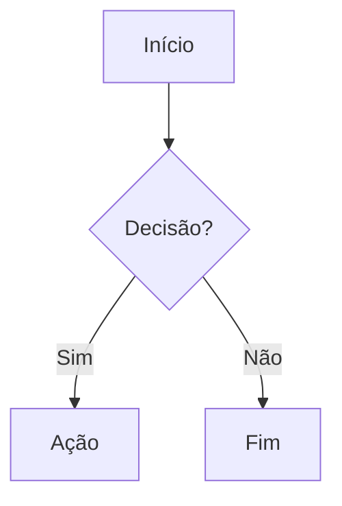

# Template — Nova Nota

> [!tip] Como usar
> Copie o bloco abaixo para o novo arquivo e apague o que não serve. Mantenha os campos do frontmatter.

````markdown
---
tags: []
tipo: documento | requisito | decisao | checklist | template
status: rascunho | ativo | cancelado
atualizado: AAAA-MM-DD
---

# Título da Nota

> [!abstract] Resumo em 1–2 frases (opcional)

## Contexto / Objetivo
Por que esta nota existe.

## Conteúdo principal
Tabelas e listas preferencialmente.

## Diagrama (se aplicável)



## Links
- [[Documento relacionado]]
````

## Convenções de nome de arquivo
- Sem caracteres `: \ /` (quebram links no Obsidian)
- Acentos ok; espaços ok
- Padrões existentes: `<Nome>.md`, `ADR-0XX <título>.md`
